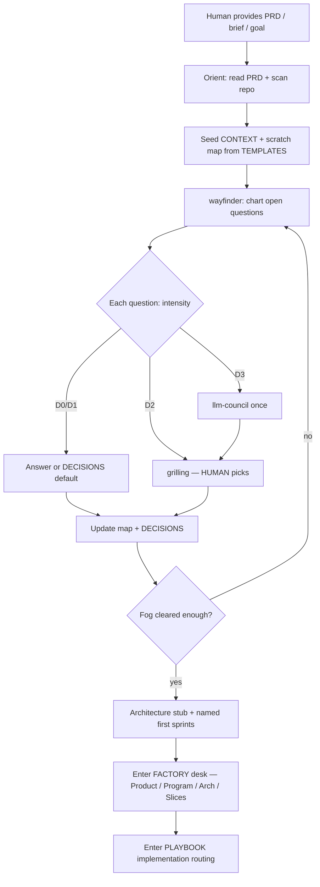

# FROM-PRD — intake that locks a project before code

Use when the human drops a **PRD, brief, PDF, “build X”, or just an idea** and there is no trustworthy `DECISIONS.md` + wayfinder map yet.

If the repo is not adopted yet (no `agent-os/` / no `docs/agents/`), run **setup grilling** first (`SETUP.md` — wayfinder-style Q1–Q8), then continue here.

**No PRD? Fine.** Treat the idea as the brief. Run a short **idea grilling** (below) to produce a one-page destination, then the same wayfinder fog loop. Do not invent a fake PRD document.

**Locks already exist, but they are stumped on the next feature / improvement?** Do not restart FROM-PRD. Use **Stumped / next features** in `playbook.md` (context pack + research, they pick).

This is the same intake used for take-homes and greenfield ideas (orient → decide with skills → design → build). It is **scale-adaptive**: tiny projects exit early; large ones keep more tickets.

---

## Goal

Leave intake with:

1. `CONTEXT.md` — what this is / is not  
2. `DECISIONS.md` — locked choices (≤1–2 pages)  
3. `.scratch/<project-slug>/map.md` — wayfinder destination + open fog  
4. `docs/ARCHITECTURE.md` stub (personas + user-facing vs internal)  
5. Optional: `docs/agents/` overlay (issue tracker, domain, triage)  

**Do not** start feature code until (2) and a clear-enough (3) exist.

---

## Flow

---

## Step-by-step (agents)

### 0. Orient

- If a PRD/brief file exists: read it fully. Quote constraints (deadline, deliverables, hard “must not”).
- If **only an idea** (chat sentence, napkin pitch): skip file ingest; run **Idea grilling** next.
- Scan repo: existing code? existing `CLAUDE.md`? secrets?
- Ask **at most one** clarifying question if the goal is unusable; otherwise proceed with explicit assumptions listed in `CONTEXT.md`.

### 0b. Idea grilling (when there is no PRD)

Same rules as grilling: **never answer for the human** on preference. One batch is enough:

| # | Ask | Locks into |
|---|---|---|
| I1 | What does “done” look like in one sentence? (demoable outcome) | `CONTEXT` Destination |
| I2 | Who is the user? (operator / end-user / API) | Personas |
| I3 | Hard constraints? (deadline, stack, offline, budget, must-not) | Constraints |
| I4 | What is explicitly **out of scope** for v1? | Non-goals |
| I5 | Any non-negotiable tech preference? (or “agent proposes”) | early `DECISIONS` / fog tickets |

Then write `CONTEXT.md` from I1–I4, chart wayfinder tickets for everything still foggy (I5 and unknowns), and continue from step 1. Optional: save a short `BRIEF.md` from the answers — nice-to-have, not required.

Tiny idea (“script that renames photos”) → often D0 defaults + almost no tickets. Big idea (“competitor to X”) → full wayfinder + D3 where rewrite would hurt.

---

### 1. Seed files

Copy from `agent-os/TEMPLATES/` (or skill `assets/templates/`) if missing:

**Always**

- `CONTEXT.md`
- `DECISIONS.md`
- `.scratch/<slug>/map.md`
- Root `CLAUDE.md` pointer to Agent OS + future overlay

**Process overlay (into `docs/agents/`)**

- `issue-tracker.md`
- `triage-labels.md`
- `domain.md`
- `skills-playbook.md` ← from `skills-playbook.overlay.md` (fill sprints)
- `tooling-ready.md` ← checklist stub

**Design stub**

- `docs/ARCHITECTURE.md` ← from `ARCHITECTURE.stub.md`

Do **not** invent product contract docs (schema, HITL, mock, …) until that module is designed — see `BUNDLE.md`.

### 2. Wayfinder — chart the fog

- Create **decision tickets** for real forks (not chores).
- One active decision ticket at a time (research tickets may be AFK).
- Keep `map.md` as the scoreboard: Destination, Decisions so far, Not yet specified, Out of scope.

Skill: **wayfinder** (Matt Pocock skills — see `TOOLING.md`).

### 3. Resolve tickets with intensity

| Intensity | Use |
|---|---|
| **D0** | Reversible + obvious from PRD → lock in `DECISIONS.md` |
| **D1** | Small fork → wayfinder Answer without council |
| **D2** | Preference / naming / taste → **grilling** (never answer for the human) |
| **D3** | Expensive / irreversible → **one** `llm-council` → then grilling |

Skills: **grilling** / **grill-me**, **domain-modeling** (when glossary shifts), **llm-council**.

### 4. Architecture stub

- Personas (who touches what).
- Mermaid: user-facing vs internal.
- Link contracts you will need (schema, API, evidence) as empty stubs — fill when building that module.

### 5. Name delivery sprints

Self-descriptive outcome names (never “Sprint 1”). Example pattern: `Scaffold-CLI-and-Config`, `Core-Happy-Path`, `Evidence-and-Writeup`. Put the sequence in the project overlay or map Notes.

### 6. Hand off to the factory desk, then build

- Confirm human on remaining provisionals **or** accept provisionals explicitly.
- Seed `.scratch/<slug>/factory-gate.md` from the factory-gate template.
- Enter [`factory.md`](./factory.md) (Product → Program Design → Architecture → Vertical Slices). Skip a stage only if its exit artifact already exists.
- Dual-skill on if a pair is installed for the active stage (`dual-skill.md`).
- Only then enter [`playbook.md`](./playbook.md) implementation routing with **ponytail** on. Tiny D0/I0 work may skip the desk.

---

## Human role (required)

| Moment | Human does |
|---|---|
| Preference locks | Answers grilling |
| Cut scope | Confirms out-of-scope list |
| Provisionals | Accepts or overrides (e.g. Zod vs Ajv) |
| Mid-flight retarget | Approves cutting a promised demo path |

Agents **must not** silently invent product taste, brand, or irreversible schema when a human is available.

---

## Exit criteria (intake done)

- [ ] `CONTEXT.md` states destination and non-goals  
- [ ] `DECISIONS.md` has locked rows for language, shape of done, critical tech  
- [ ] Map “Not yet specified” is empty **or** only labeled provisionals  
- [ ] First named sprint “Done when” is written  
- [ ] Human OK to leave intake (or provisionals accepted)  
- [ ] Factory gate seeded — do **not** treat intake as a license to skip Product / Program / Architecture / Slices on anything bigger than I0  

Then stop deciding. Run the factory desk. Then build.
