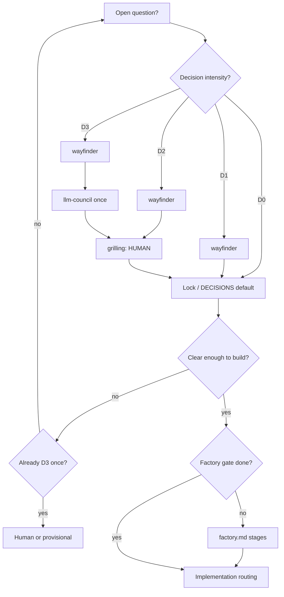
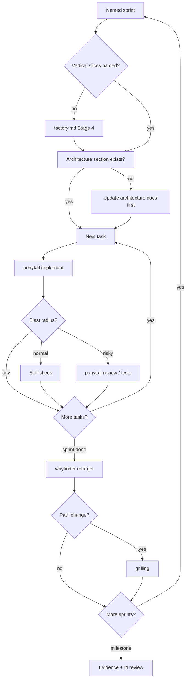

# PLAYBOOK — decision + implementation routing (any project)

Canonical routers for agents. Project overlays may add phase matrices and sprint names; they must **not** weaken intensity caps (no “council everything”).

---

## Default posture

1. **Decide with intensity** (D0–D3) — human via grilling when preference/irreversible.  
2. **Factory before Build** — Product → Program Design → Architecture → Vertical Slices (`references/factory.md`). Horizontal design = seams, not layer tickets. Skip the desk only on D0/I0 or when that stage’s artifact is already trustworthy.  
3. **Interface before body** — lock the public surface (`modules.md`); callers and most turns stop there. Design before module code (Mermaid + prose with the change).  
4. **Implement with intensity** (I0–I4) — named sprints; not review-everything.  
5. **Ponytail** = anti-overengineering; **this playbook** = anti-overthinking.  
6. **Prove** with real runs/evidence, not screenshots alone.  
7. Do not run every installed skill every turn. See `references/skill-catalog.md` (vendored: keep a copy under `agent-os/` or rely on the skill).  
8. **Companion decide** — gstack, graphify, Graft, browser QA, and other catalog companions are always *eligible to consider*; for each phase, decide use **or** skip. Missing companions must not block D0/I0 (see `references/tooling.md`). Project `docs/agents/tooling-ready.md` records ready vs optional.  
9. **Skill inventory** — if `docs/agents/skill-inventory.local.md` exists (from `scripts/scan-global-skills.sh`), use it to **suggest** skills for this phase (cap **0–3**). User focuses on the project/sprint name; agent picks skills. Never dump the full inventory into every turn.  
10. **Dual-skill** — when two similar skills exist for this job (D2+/I2+, factory, plan, or implement), spawn two agents and merge, then one actor (`references/dual-skill.md`). Not on I0. Cap one pair per phase.  
11. **Capabilities** — name the job, then dispatch or fallback (`references/capabilities.md`). Do not copy gstack/pstack trees into this kit.  
12. **Skill roots** — any harness may `Read` installed `SKILL.md` files (`references/skill-roots.md`). Hosts do not auto-index each other.
13. **Vague invoke** — no job named: orient. **One clear next → say it and go** (no full list). Two or more live nexts → short list of **only those**. Never dump all eight.

---

## Vague invoke (bare “Agent OS” / slash with no job)

Orient first. Then **only as much menu as the fog**.

**They named the job → skip this section** (examples): `setup this project`, `FROM-PRD`, `intake`, `next features`, `hygiene` / `all surveys`, `continue sprint <Name>`, `implement ticket <id>`, a named gstack/pstack job (`/review`, arena, qa). Go to that row in `SKILL.md`.

**Otherwise — orient only** (read-only, no `src/` dump): `DECISIONS.md`, map, factory-gate, overlay sprints / open tickets.

### One clear next → no list. Say it and go.

If artifacts leave **exactly one** legal next, do **not** print 1–8. One sentence, then that mode.

| Repo looks like | Do (no list) |
|---|---|
| No DECISIONS / map | **Intake** |
| Locks exist, factory gate unfinished | **Factory** — the unfinished stage only |
| Slices + one named sprint with an open ticket | **Build** that ticket |
| Not adopted and they invoked setup-ish | **Setup** grilling |

```text
Next: Factory — Architecture (gate still open). Starting.
```

### Two or more live nexts → short list of **those only**

Do **not** show dead options (no Intake if locks exist; no Build if there is no ticket). Stop and wait.

Typical live pairs: Build vs next features; Hygiene vs next features; Factory leftover vs Build; Decide a named fork vs continue the sprint.

```text
Not unique — pick one:
• Build — ticket 04 in sprint <Name>
• Next features — context + research
• Or say the job
```

**Unclear on purpose** (they said improve / something / make it better, or factory done with **no** open ticket): live options only — usually Next features vs Hygiene vs “say the job.” Nested Hygiene / Stumped menus only after that pick.

Never: dump all eight. Never: council to choose the number. Never: invent a second option so you can show a menu. One clear next is a gift — take it.

---

## Decision intensity

| Rung | When | Do |
|---|---|---|
| **D0 Default** | Reversible + already decided | Use `DECISIONS.md` |
| **D1 Frame** | New, low stakes | wayfinder ticket → Answer → map |
| **D2 Grill** | Preference / naming | wayfinder → **grilling (HUMAN)** → lock |
| **D3 Council+Grill** | Expensive / irreversible | wayfinder → **one** llm-council → grilling → lock |
| **D4 Stop** | Still foggy after D3 | Human picks or provisional; no second council |



**Rejected:** wayfinder + llm-council on every question.

---

## Implementation intensity

### Named sprints

Outcome names tied to the product slice. Tasks = checklist under the sprint. No epic/OKR theater.

### Rungs

| Rung | When | Do |
|---|---|---|
| **I0 Ship** | Tiny reversible edit | ponytail → code → smoke |
| **I1 Task close** | Normal task | ponytail → implement → self-check → map checkbox |
| **I2 Risky task** | Schema, auth, money, secrets, classifiers | I1 + ponytail-review or focused tests |
| **I3 Sprint close** | Sprint “Done when” met | **wayfinder retarget**; optional **hygiene pass** below; council only if new expensive fork; **human** if path cuts demo scope |
| **I4 Slice / release** | Milestone or submit | One of: multi-lens-review, critic, or gstack `/review` — not all stacked by default |



**Rejected:** multi-lens + code-review + council after every task.

### Stumped / next features (product fog — not hygiene)

**When:** they know the repo should get **better or more features**, but they have **no idea which**. Phrases: stumped, what’s next, add features, improve the product, I don’t know what to build, ideas?

This is **Factory Product**, not a code rewrite and not “council everything.”

Vague “make it better” / “improvement” with **no** feature vs code hint → ask once:

```text
Stuck on what?
A. Next features / product ideas — context + research, you pick (this section)
B. Code hygiene — deepen / simplify / perf (Hygiene pass below)
C. Both as two separate lists — you still pick one card from one list
```

They already said features / ideas / stumped / what’s next → skip that ask; run **A**.

**Do this**

1. **Context pack (required, before the web).** `CONTEXT.md`, `DECISIONS.md`, wayfinder map, factory-gate, overlay, README, architecture stub, non-goals, open tickets / named sprints. Module **interfaces** if a candidate would touch code. Do **not** dump `src/`.
2. **Inside gaps (read-only).** Destination unmet, brief/checklist items unused, sprint “Done when” still open, explicit user pain in docs. Tag `from-repo`.
3. **Outside research (required on this path).** Matt **research** (or web search if that skill is missing) for comparable products, common jobs-to-be-done, and constraints this domain already has. AFK research tickets are allowed in parallel. Tag `from-research`. Facts, not locks. Do not invent taste as if it were a decision.
4. **Optional dual (Product pair).** If both installed: idea-refine / brainstorming **vs** grilling-with-docs. Merge into **one** short list. Cap one pair. **Do not** llm-council the idea list.
5. **Present 3–7 directions.** Each: one sentence, `from-repo` and/or `from-research`, intensity (D0–D3 / weekend vs slice), risk. Not a 40-item dump.
6. **Human picks one** (or skip / “none of these”). Preference or naming → grill. Expensive irreversible fork → **one** D3 council, then grill. Then a wayfinder ticket (or Product lock if destination changed). **Then** factory slices if needed. **Then** Build. No feature code on this pass.

**Does not**

| Never | Why |
|---|---|
| Ship a feature because research liked it | You pick |
| Hygiene All surveys | Wrong job (shape vs product) |
| Council the idea list | D3 is for one expensive fork |
| Dump `src/` and “decide from the code” | Interface + docs first |
| Web-only with no CONTEXT / DECISIONS | Research without the project is fanfic |

Say `Agent OS: next features` or pick **A**. Research without a pick is still not a license to code.

---

### Hygiene pass (I3 or muddy tree — not a named mode)

**Ask before acting.** “Optimize,” “something,” “make it better,” hygiene pass, simplifier, architecture, or “the tree is muddy” are **fog**. Do not guess. Do not start rewriting every function. If they meant **product ideas / features**, use **Stumped / next features** above — not this menu.

```text
Which do you want?
1. All surveys — multiple read-only agents (deepen + simplify + perf suspects). You pick one card. No edits. No council.
2. Deepen architecture only (Matt)
3. Simplify only — same behavior, clearer expression
4. Performance only — measure a hot path, then change that path
5. Skip — not now
```

If they said **all** / “all of them” / “explore everything”: skip the menu, run **1**.  
If they said **abstraction** / “make it generic”: that is **not** 1–3 by default. Ponytail: extract only when two real callers exist. Offer 2 or skip.

Run **only** the number they pick. If they already named one skill clearly and nothing else, skip the menu.

**What is actually done**

| Pick | Touches | Does not |
|---|---|---|
| **1 All surveys** | Parallel **read-only** explorers → tagged lists. You pick **one** card | No merge. No council. No implement-all |
| **2 Architecture** | **Module shape** (one cluster) | Not every function. Not a new layer |
| **3 Simplifier** | **Expression** inside existing functions | Not speed. Not new frameworks |
| **4 Performance** | One **measured** bottleneck | Not “optimize all functions” |
| **5 Skip** | Nothing | — |

Never: walk every function. Never: abstract on spec. Never: optimize without a number. Never: act on every suggestion.

Trigger after they pick **1**: *sprint close*, *muddy tree*, or *brownfield session start*. **Not** I0/I1. **Not** every commit. **Not** always-on. Skip if the last architecture survey is newer than ~2 days.

`code-simplification` and `improve-codebase-architecture` are **opposite jobs**, not a dual-skill pair. Do not merge them. Do **not** llm-council the suggestion list.

**All surveys (pick 1)**

Spawn in parallel, read-only, no file edits:

- Agent A — Matt `improve-codebase-architecture` (HTML deepen candidates)  
- Agent B — `code-simplification` (local nicks, same behavior)  
- Agent C — performance **suspects** only (label `speculative` unless a bench/profile exists)

Present three tagged lists. Human picks **one** item (or skip). Same cluster: deepen before thin before speed. Then grill → ticket → **one** builder (ponytail). Simplifier inside a module only **after** the shape is locked, or instead of a deepen if they chose flatten.

Cap: one All/hygiene pass per I3.

Mid-sprint retarget only if: assumptions broke, blocked ≳1h, or human changed goals.

---

## Modularity

- **Inside repo:** clear seams, one job per module, pure functions at boundaries.  
- **Outside / other projects:** do not publish packages “just in case.” Clean folders copy later.

---

## Anti-overthinking vs anti-overengineering

| Failure | Guard |
|---|---|
| Too much code / abstraction | **ponytail** |
| Endless councils / tickets / reviews | **Intensity caps** + human stop |

---

## Session start

1. Vague invoke → **Vague invoke** above. One clear next → go. Else short live list, stop.  
2. `DECISIONS.md` (if any)  
3. Factory gate — unfinished Product / Program / Architecture / Slices? → `factory.md` **only if they picked Factory / Build needs slices**  
4. Module index — read the **interface** of the module you will touch (`modules.md`). Do not dump `src/`.  
5. This playbook + project overlay  
6. Wayfinder map — open tickets? which named sprint?  
7. Architecture section for that module (runtime / trust / failure if I2+)  
8. Dual-skill if a live pair applies to this phase  
9. Ponytail full for code — tests through the same seam callers use  
10. No secrets in git; no invented preference locks  
11. Brownfield and the tree looks like many tiny squares with stray arrows → offer Hygiene **2**, do not auto-run the survey on vague invoke  
