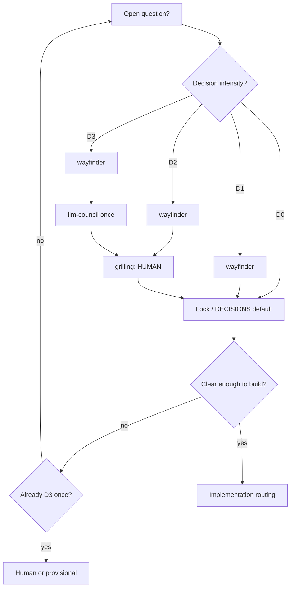
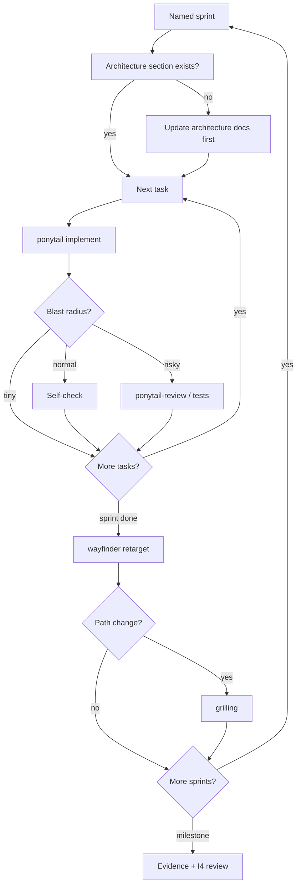

# PLAYBOOK — decision + implementation routing (any project)

Canonical routers for agents. Project overlays may add phase matrices and sprint names; they must **not** weaken intensity caps (no “council everything”).

---

## Default posture

1. **Decide with intensity** (D0–D3) — human via grilling when preference/irreversible.  
2. **Design before module code** — Mermaid + prose with the change.  
3. **Implement with intensity** (I0–I4) — named sprints; not review-everything.  
4. **Ponytail** = anti-overengineering; **this playbook** = anti-overthinking.  
5. **Prove** with real runs/evidence, not screenshots alone.  
6. Do not run every installed skill every turn. See `references/skill-catalog.md` (vendored: keep a copy under `agent-os/` or rely on the skill).

---

## Decision intensity

| Rung | When | Do |
|---|---|---|
| **D0 Default** | Reversible + already decided | Use `DECISIONS.md` |
| **D1 Frame** | New, low stakes | wayfinder ticket → Answer → map |
| **D2 Grill** | Preference / naming | wayfinder → **grilling (HUMAN)** → lock |
| **D3 Council+Grill** | Expensive / irreversible | wayfinder → **one** llm-council → grilling → lock |
| **D4 Stop** | Still foggy after D3 | Human picks or provisional; no second council |

**Rejected:** wayfinder + llm-council on every question.

---

## Implementation intensity

### Named sprints

Outcome names tied to the product slice. Tasks = checklist under the sprint. No epic/OKR theater.

### Rungs

| Rung | When | Do |
|---|---|---|
| **I0 Ship** | Tiny reversible edit | ponytail → code → smoke |
| **I1 Task close** | Normal task | ponytail → implement → self-check → map checkbox |
| **I2 Risky task** | Schema, auth, money, secrets, classifiers | I1 + ponytail-review or focused tests |
| **I3 Sprint close** | Sprint “Done when” met | **wayfinder retarget**; council only if new expensive fork; **human** if path cuts demo scope |
| **I4 Slice / release** | Milestone or submit | One of: multi-lens-review, critic, or gstack `/review` — not all stacked by default |

**Rejected:** multi-lens + code-review + council after every task.

Mid-sprint retarget only if: assumptions broke, blocked ≳1h, or human changed goals.

---

## Modularity

- **Inside repo:** clear seams, one job per module, pure functions at boundaries.  
- **Outside / other projects:** do not publish packages “just in case.” Clean folders copy later.

---

## Anti-overthinking vs anti-overengineering

| Failure | Guard |
|---|---|
| Too much code / abstraction | **ponytail** |
| Endless councils / tickets / reviews | **Intensity caps** + human stop |

---

## Session start

1. `DECISIONS.md` (if any)  
2. This playbook + project overlay  
3. Wayfinder map — open tickets? which named sprint?  
4. Architecture section for the module you will touch  
5. Ponytail full for code  
6. No secrets in git; no invented preference locks  
