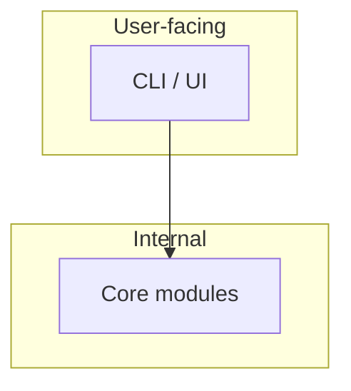

# Architecture map — user-facing vs internal (stub)

**Rule:** Design and document *before* implementing a module. Update this file in the same change as the code.

See also: `DECISIONS.md`, Agent OS playbook.

---

## 1. Who is “the user”?

| Persona | Role | Touches |
|---|---|---|
| Operator | | |
| Calling agent / API consumer | | |
| System | Internal only | |

---

## 2. User-facing vs internal

---

## 3. Module index (fill as you build)

| Module | Doc / contract | Status |
|---|---|---|
| | | stub |
