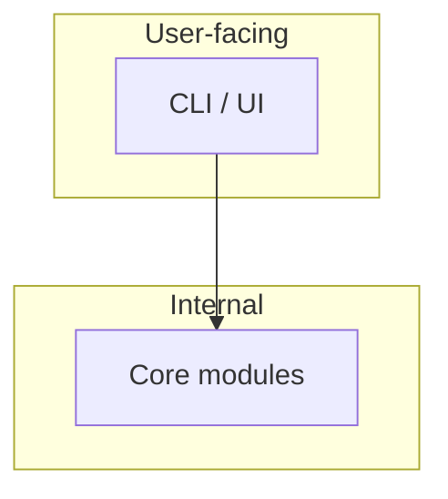

# Architecture map — user-facing vs internal (stub)

**Rule:** Design and document *before* implementing a module. Update this file in the same change as the code.

See also: `DECISIONS.md`, Agent OS playbook.

---

## 1. Who is “the user”?

| Persona | Role | Touches |
|---|---|---|
| Operator | | |
| Calling agent / API consumer | | |
| System | Internal only | |

---

## 2. User-facing vs internal

---

## 3. How it runs / fails / is trusted / changes

| View | Notes |
|---|---|
| Runtime (process, store, offline) | |
| Trust (where untrusted input enters) | |
| Data (who owns records; what crosses a seam) | |
| Failure (timeout, retry, degrade) | |
| Change (cheap vs expensive to reverse) | |

## 4. Module index (filesystem = map)

Public exports only. Kind is per module — not “API” by default. Full glossary + table: `docs/agents/modules.md`.

| Module (folder) | Interface kind | Public entry | Status |
|---|---|---|---|
| | function / package / CLI / HTTP / UI / events / port | | stub |
