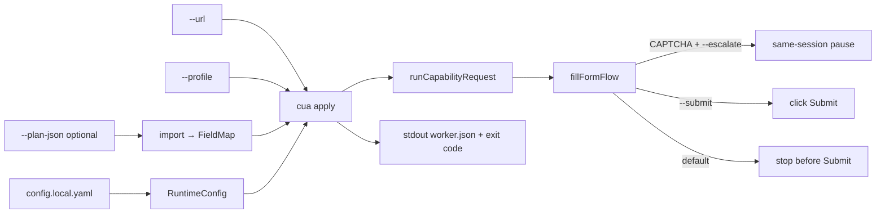

# Apply UI — operator & worker guide

Canonical reference for `cua apply` / `cua import-plan`. Roadmap/locks: `docs/PRODUCTIZE.md`, `DECISIONS.md` (G1–G21). Hygiene: `docs/REPO-HYGIENE.md`.

## Operator triangle (what you supply)

| You give | How | Notes |
|---|---|---|
| **URL** | `--url` | Page to open; live hosts need `config.local.yaml` allowlist |
| **Profile** | `--profile` | Fill values; vault JSON OK → `normalizeApplyProfile` / `answers.*` |
| **Wiring** | `--field-map-id` and/or `--plan-json` | Else auto seed + repair; never bake PII into Capability |

**Outputs are read after the run** (not authored ahead): stdout / `worker.json` (`outcome`, `exitCode`, `phases`, `gathered`), `fill-receipt.json`, `profile-shape.json` (key names only), screenshots under `evidence/private/<runId>/`.

Optional: `--submit` (irreversible), `--escalate` (CAPTCHA HITL), resume via `resumePath` under `.private/`. **Never commit** `.private/` or career-data vault files — copy with `scripts/copy-vault-private.sh` only.



`apply` / `replay` / `invoke` share `runCapabilityRequest` (writes `result.json`; apply still owns worker summary / exit codes). Hybrid craft/repair LLM goes through `callModel` (Ollama default; Anthropic/OpenAI when configured).
## Preconditions

1. `./scripts/setup.sh` (Node 20+, Playwright Chromium).
2. Profile JSON **inside the repo** (path jail). Prefer `fixtures/` demos or copy vault JSON into gitignored `.private/`.
3. Live hosts: copy `config.local.example.yaml` → **`config.local.yaml`** (gitignored) and add ATS hosts. Wildcards are **literal strings** today — use concrete hosts (e.g. `nvidia.wd5.myworkdayjobs.com`).
4. Mock demos: `npm run mock` (or `ensure-mock` via scripts).

## Quick paths

### Local mock (no allowlist change)

```bash
npm run mock   # terminal 1
npx cua apply --url http://127.0.0.1:4173/apply-demo/co-a/ \
  --profile fixtures/applicant-profile.json \
  --field-map-id demo-co-a
```

One-item claim (career-data handshake / T-L-3):

```bash
npx cua apply --claim-json fixtures/sample-apply-claim.json
# career-data queue item shape (needs profile already under repo):
npx cua apply --item-json fixtures/sample-queue-item.json \
  --profile fixtures/applicant-profile.json \
  --field-map-id demo-co-a --no-submit
# Stage vault first if paths live outside the repo:
# ./scripts/copy-vault-private.sh --vault-root ~/Developer/career-data path/to/profile.json path/to/resume.pdf
```

### Import plan then apply

```bash
npx cua import-plan --plan-json fixtures/sample-apply-plan.json --id sample-plan-demo
npx cua apply --url http://127.0.0.1:4173/apply-demo/co-a/ \
  --profile fixtures/applicant-profile.json \
  --field-map-id sample-plan-demo
```

### Live ATS (fill-only)

```bash
cp config.local.example.yaml config.local.yaml
# edit allowedHosts for the apply URL host

npx cua apply --url "$APPLY_URL" \
  --profile .private/my-profile.json \
  --plan-json .private/plan.json \
  --headed --escalate \
  --storage-state .private/storage-state.json
# add --submit only when you intentionally want Submit clicked
# scripts/apply-live.sh --submit also requires CUA_LIVE_SUBMIT_GO=1
```

Golden CI (mock only): `npm run check:golden`.

`cua doctor` — build/config/allowed_hosts/path_jail/playwright (+ optional fixtures/.private) as JSON lines; exit 1 if required checks fail.  
`cua last [--limit N]` — newest `evidence/private/*/worker.json` summaries (outcome/exit/mode only; no PII values).

Live attended submit runbook: `.scratch/land-live-submit-runbook.md`. One-item shim: `scripts/cua-apply-from-item.sh`.

---

## `cua import-plan`

Converts upstream **plan JSON** → `capabilities/field-maps/<id>.json`. Planning stays outside this repo.

| Flag | Required | Default | Notes |
|---|---|---|---|
| `--plan-json <path>` | yes | — | Must resolve under project root |
| `--id <id>` | no | `imported-plan` | FieldMap `id` / filename stem |
| `--out <path>` | no | `capabilities/field-maps/<id>.json` | Write path under project root; realpath nearest ancestor (symlink escape refused) |
| `--ats <family>` | no | from plan `ats` or omit | `ashby\|lever\|greenhouse\|workday\|auto` |
| Global config flags | no | — | See below |

**Accepted plan shape** (also `docs/artifact-schema.md`, `fixtures/sample-apply-plan.json`):

```json
{
  "ats": "ashby",
  "successBanner": "Application received",
  "plan": [
    {
      "path": "email",
      "type": "text",
      "label": "Email",
      "profilePath": "email",
      "required": true
    }
  ]
}
```

Alias: `fields` array instead of `plan`.

**Locator rank policy:** `label` (if provided) → `name=` css → id css; UUID-looking `#…` selectors only at **rank ≥ 3**.

Stdout: `{ ok, fieldMapId, out, fields }`. Exit `1` on error.

---

## `cua apply`

Worker entry: set target from `--url`, optional import, write experiment Capability shell, `fillFormFlow`, print **worker summary**, set **exit code**.

### Apply-specific flags

| Flag | Required | Default | Notes |
|---|---|---|---|
| `--url <url>` | if no claim/item | — | Full apply URL; origin → `target.baseUrl`, path+search → `entryPath`; host auto-added to allowlist via CLI layer |
| `--claim-json <path>` | no | — | One-item claim (`schemaVersion: 1`); supplies url/profile/plan/submit (T-L-3) |
| `--item-json <path>` | no | — | Career-data queue item (`url`/`apply_url` + `paths.pdf`); requires `--profile` |
| `--ats <family>` | no | `auto` | `auto` uses URL/body detect; else force family |
| `--profile <path>` | no | — | Repo-relative; vault aliases normalized |
| `--plan-json <path>` | no | — | Import → FieldMap id `imported-<family>` (or `--field-map-id`) |
| `--field-map-id <id>` | no | `auto-<family>` or imported id | Must exist under `capabilities/field-maps/` unless just imported |
| `--mode <mode>` | no | `deterministic` | `hybrid` enables craft/repair LLM when stuck / empty craft fields |
| `--company-context <text>` | no | — | Hybrid craft company/role blurb (with live question text from the form) |
| `--escalate` | no | off | Same-session HITL on captcha/policy/stuck; implies headed |
| `--submit` / `--no-submit` | no | **off** | Click Submit (G6). `--no-submit` forces fill-only even when claim.submit is true |
| `--evidence <dir>` | no | `evidence/private/<runId>` | Prefer private; gitignored |
| `--write-field-map` | no | off | Persist repaired maps |
| `--form-repair-max <n>` | no | `3` | Stuck repair loop 1–5 |
| `--record-har` | no | off | Write `network.har` under evidence |
| `--har-on-failure` | no | off | With HAR: drop file on success |
| `--trace-on-failure` | no | off | Keep `trace.zip` only on fail |

### Global flags (all commands)

| Flag | Notes |
|---|---|
| `--provider` / `--model` / `--ollama-url` | LLM routing |
| `--base-url` | Usually overridden by `--url` origin on apply |
| `--headed` | Headed Chromium |
| `--verbose` | Debug logs (`CUA_LOG=debug`) |
| `--max-steps` / `--step-timeout-ms` / `--run-timeout-ms` | Limits |
| `--config <path>` | Alternate yaml (**skips** sibling `config.local.yaml`) |
| `--storage-state <path>` | Repo-relative Playwright storageState (load if exists; save on close) |

---

## Exit codes & `worker.json`

Stdout is a single JSON object (also written to `evidence/.../worker.json`):

```json
{
  "ok": true,
  "outcome": "filled",
  "code": null,
  "evidenceDir": "evidence/private/apply_…",
  "runId": "apply_…",
  "exitCode": 0,
  "mode": "fill-only",
  "phases": ["transform", "fill", "verify", "report"],
  "gathered": {
    "extracts": {},
    "filled": [{ "key": "email", "profilePath": "email", "verified": true, "actual": "a***@example.test" }],
    "missingOutputs": [],
    "submitVerified": false,
    "submitAttempted": false,
    "submitVerifyState": "not_requested"
  }
}
```

| `exitCode` | Typical `outcome` | When |
|---|---|---|
| **0** | `filled` or `submitted` | `SUCCESS`; **`submitted` only if `--submit` and confirmation banner observed** |
| **2** | `captcha` or `paused` | HITL pause / `form.CAPTCHA` (use `--escalate`) |
| **3** | `closed` | `form.CLOSED` |
| **4** | `unmapped` / `verify` / `submit_unconfirmed` / `duplicate` / `failed` | `field.UNMAPPED`, `field.VERIFY`, **empty fill**, **Submit clicked without confirmation**, **G21 double-submit refuse** (`form.DUPLICATE`), other failures |

`worker.json` includes `"mode": "fill-only" | "submit"`, **`phases`** (G18: transform/fill/submit/verify/report that actually ran), and **`gathered`** (G14/G17/G19): redacted fill-receipt entries + extracts + `missingOutputs` + `submitVerifyState` + optional `skippedOptional` / `missingRequiredPaths` / confirmation fields. On **`--submit` + verified banner** (`outcome: submitted`), `gathered.filled` is empty — primary signal is `submitVerified: true` plus optional `confirmationText` / `confirmationReference` (G15/G17). `--submit` with click but no thank-you banner → **`outcome: submit_unconfirmed`** (exit 4), not `submitted`. If required receipt keys are still unverified, Submit is **not clicked** (G20) → typically `outcome: verify` / exit 4. A second `--submit` for the same job URL + profile email is **refused** from `.private/submit-ledger.json` (G21; delete the file to reset). Apply also writes **`profile-shape.json`** (key names only — no PII values).

Messy profiles (G13): unknown top-level scalars are parked under `answers.*` by `normalizeApplyProfile` so repair/FieldMaps can still bind them.
Prefer Ashby **`/application`** URLs; Overview alone used to false-green — now opens Application / Apply (same host only), or exits **4** if still empty.

**Daily live helper** (fill-only unless `--submit`):

```bash
./scripts/apply-live.sh \
  --url "$ASHBY_APPLICATION_URL" \
  --profile-from ~/path/to/apply-profile.json \
  --resume ~/path/to/role.pdf \
  --headed --escalate
```

Requires `npm run build` first (wrapper calls `node dist/cli/main.js`, never bare `npx cua`).  
Missing FieldMap seeds cache under **`.private/field-maps/`** (gitignored) **only after at least one verified fill** (G16 / T-G-5). If you passed `--submit` and a submit click ran, cache also waits for confirmation. Use `--write-field-map` only to promote into tracked `capabilities/field-maps/`. Proposed maps under evidence stay uncapped for debug.

**Factory live matrix (fill-only, 2026-09-14 — gitignored evidence only):**

| Row | Host | Result |
|---|---|---|
| B | Ashby Maximor `/application` | exit **0** `filled` → `evidence/private/factory-matrix-ashby-*` |
| C | Lever 100ms `/apply` | exit **0** `filled` → `evidence/private/factory-matrix-lever-*` |
| C | Greenhouse Figma job board | exit **0** `filled` **fill-only** (2026-09-14 land: scoped react-select read; run `factory-matrix-greenhouse-20260914-230335`) |

Never commit those dirs or `--submit` on live matrix runs.

Location widgets: type **`City, ST`**, select only if the option contains that **city token** (and region when present). No match → skip (optional) / fail (required) — never blind first-hit.

### `--submit` matrix

| Flags | Behavior |
|---|---|
| default | Fill / advance pages; **stop** when Submit is the only advance |
| `--submit` | Click Submit when visible **only if** required receipt keys are verified (G20) **and** job+profile not already in submit ledger (G21); set `submitConfirmed` only if confirmation text/banner appears; worker `gathered.submitVerified` |
| `--submit` without confirmation | Flow ends; **`outcome: submit_unconfirmed`** (exit **4**) if Submit was clicked; do not claim submit |
| `--submit` + confirmation | **`outcome: submitted`** — verify delivery; `gathered.confirmationText` / `confirmationReference` when scrapeable; harvest light (G15/G17) |
| `--submit` but Submit never shown | **`outcome: filled`** (fill succeeded; submit not attempted) |
| `--submit` blocked pre-click | Required fields in receipt still unverified → no click; **`outcome: verify`** (exit **4**) |

Never enable `--submit` in unattended workers unless the job is intentional.

### Captcha / HITL

1. Run with `--escalate` (headed).
2. On captcha/MFA-ish / stuck: pause → `hitl/intervention.json` + screenshot under evidence dir.
3. Resume (apply defaults to **private**, not `evidence/runs/`):

```bash
npx cua escalate resume --dir evidence/private/<runId> --note "…"
# or --run <id> when the chapter lives under evidence/runs/<id>
```

4. Re-run or continue per HITL contract (`docs/hitl-contract.md`). Captcha is **never bypassed**.

---

## Profile JSON

Loaded via `--profile`; **never** written into Capability JSON.

### Common fields

| Path | Use |
|---|---|
| `fullName` / `firstName`+`lastName` | Name (split derived from `fullName` if needed) |
| `email`, `phone` | Contact |
| `linkedin` | Profile URL |
| `location` string **or** `{ city, region\|state, country }` | Address helpers; text/`location` path formats as `"City, Region, Country"` |
| `resumePath` | Upload path (repo-relative) |
| `workAuth` | Select / flags (`flags.workAuthYes`, `flags.sponsorshipNo` derived) |
| `answers.*` | Essay / custom questions |
| `education` | Array or single object (normalized to array) |
| `password` | Only if profile already declares it; env `ATS_PASSWORD` / `WORKDAY_PASSWORD` may overlay |

### Vault aliases (`normalizeApplyProfile`)

`name`→`fullName`, `linkedin_url`/`linkedinUrl`→`linkedin`, `resume`/`resume_path`→`resumePath`, `phone_number`/`mobile`→`phone`, flat `city`/`state`/`country`→`location` object.

---

## Config overlay

Precedence: **CLI > env > `config.local.yaml` > `config.yaml` > code defaults**.

- `config.local.yaml`: live `policy.allowedHosts`, optional `session.storageStatePath`.
- `--config other.yaml`: that file only (no automatic local sibling merge).
- Secrets: `.env` only — never `config set`.

See `docs/config-surface.md`.

---

## Evidence

| Path | Role |
|---|---|
| `evidence/private/<runId>/` | Default for `cua apply` (gitignored) |
| `result.json` | Full replay result |
| `worker.json` | Thin worker summary |
| `fill-receipt.json` / `ats-family.json` | When fill path runs |
| `screenshots/success.png` | End-state shot on SUCCESS (unchanged) |
| `screenshots/00-after-open-form.png` | After Overview→Application / Apply open (when that click runs) |
| `screenshots/page-{N}-before-fill.png` | Before fill on multipage index `N` (`pageIdx`, plain integer: `0`, `1`, …) |
| `screenshots/page-{N}-after-fill.png` | After fill+verify on that same page |
| `screenshots-manifest.json` | List of gallery relative paths taken this run |
| `hitl/` | Pause artifacts |
| `network.har` | Only with `--record-har`; **deleted** if not under `private/` unless `CUA_ALLOW_PUBLIC_HAR=1` |

`fillFormFlow` (used by `cua apply`) always writes the page gallery when those stages run. Screenshot failures are swallowed — they never abort apply. Empty-fill / exit 4 still keeps whatever page shots were taken. Do not commit `evidence/` or `.private/`.

Curated demo chapters stay under `evidence/g1-*` (tracked). New experiments → **private** or **runs**.

---

## Failure cheat sheet

| Symptom | Likely cause | Fix |
|---|---|---|
| `host … not in allowedHosts` | Live host missing | Add host to `config.local.yaml` |
| `after navigate: host …` | Redirect to disallowed host | Allow final host too |
| `field.UNMAPPED` | Map/profile gap | `--mode hybrid`, repair, or fix FieldMap / profile |
| `form.CAPTCHA` exit 2 | Bot wall | `--escalate`, solve manually, resume |
| `form.CLOSED` exit 3 | Job closed | Stop; don’t retry submit |
| `--profile must be inside project root` | Path outside repo | Copy into `.private/` or `fixtures/` |
| Playwright browser missing | Fresh install | `npx playwright install` |

---

## Related docs

| Doc | Topic |
|---|---|
| `docs/PRODUCTIZE.md` | Sprint status / prove commands |
| `docs/artifact-schema.md` | Plan + FieldMap schema |
| `docs/form-failure-pack.md` | Frozen failure cases |
| `docs/golden-forms.md` | Curated evidence chapters |
| `docs/hitl-contract.md` | Pause / resume |
| `docs/TRAINING.md` | Short apply snippet |
| `REPORT.md` §9 | Design write-up for this track |

## Bridge notes (plan → fill)

```bash
npx cua import-plan --plan-json fixtures/bridge-alias-plan.json --id bridge-alias-demo
npx cua apply --url http://127.0.0.1:4173/apply-demo/co-a/ \
  --profile fixtures/applicant-profile.json --field-map-id bridge-alias-demo
```

- Before Bridge: repair always bootstrapped from DOM (`fieldMap: null`) and wiped imports. After (G12): seed + gap-only merge.
- `--plan-json` / `--field-map-id` **seeds** fill; repair adds gaps only (LLM replace keeps prior `literal`).
- Survey / plan **literals win** over *optional* heuristic keys that share the same control (e.g. `whyCompany` vs `additional` on one textarea). They **do not** displace required fields (e.g. workAuth).
- Empty `"plan": []` does **not** fall through to `fields[]` — omit `plan` or put steps in `plan`.

### Resume PDF (path jail)

Resume uploads must resolve **under the project root** (symlinks that escape are rejected). File fields always read **`resumePath`** from the profile (nested vault paths and plan `profilePath` are not used — set top-level `resumePath`). Allowed extensions: `.pdf`, `.doc`, `.docx`, `.txt`, `.rtf`, `.odt`.

```bash
bash scripts/copy-resume-private.sh /path/to/your-resume.pdf
# or:
mkdir -p .private
cp /path/to/your-resume.pdf .private/resume.pdf
# in profile JSON:
#   "resumePath": ".private/resume.pdf"
```

Plan JSON must **not** put file paths in `value` for upload fields — file kinds ignore plan `literal` and use `resumePath` from the profile only. Prefer allowlisted `profilePath` values (`answers.*` / `flags.*` / apply keys). Opaque or unanswered keys are **coerced** to `_plan.<path>` (import still succeeds; literals attach) — they no longer abort the whole plan.

- Plan aliases accepted: `title`→label, `isRequired`→required, `name`→path; resolved `value` stored as FieldMap `literal`. Plan JSON is Zod-validated at import.
- Optional `surveyPlan[]` merges after `plan[]`.
- `successBanner` on the plan/map is used in submit/done detection (**exact** match; ignored if shorter than 12 characters — falls back to built-in phrases).
- **Resume PDF:** copy into `.private/` (or another path under the repo) and set `resumePath`. Paths outside the project root are rejected (path jail).
- Nested vault profiles: `normalizeApplyProfile` hoists `identity` / `contact` / `personal` / `work_auth` / `work_authorization` / `workAuthorization` / `sponsorship` / nested `answers` / `education[0]` (incl. `discipline`→`fieldOfStudy`) into apply-profile keys. Also maps `form_defaults.authorized|sponsorship` and `identity.location` → `location`. Bare `workAuth: "Yes"` / `"No"` normalize to `Authorized` / `Not authorized`. Sponsorship flags come from vault sponsorship fields — bare `Authorized` does **not** imply `flags.sponsorshipNo`.

### career-data → `.private/` (ops + adapter)

```bash
# B is in code; A is copy into path jail:
bash scripts/copy-vault-private.sh /path/to/career-data/search/apply-profile.json /path/to/resume.pdf
# ensure profile has: "resumePath": ".private/resume.pdf"
```
