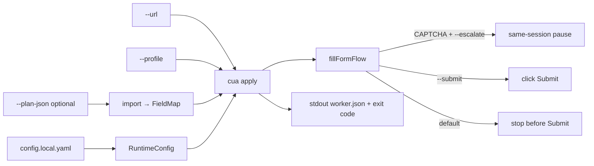

# Apply UI — operator & worker guide

Canonical reference for `cua apply` / `cua import-plan`. Roadmap/locks: `docs/PRODUCTIZE.md`, `DECISIONS.md` (G1–G12). Hygiene: `docs/REPO-HYGIENE.md`.



## Preconditions

1. `./scripts/setup.sh` (Node 20+, Playwright Chromium).
2. Profile JSON **inside the repo** (path jail). Prefer `fixtures/` demos or copy vault JSON into gitignored `.private/`.
3. Live hosts: copy `config.local.example.yaml` → **`config.local.yaml`** (gitignored) and add ATS hosts. Wildcards are **literal strings** today — use concrete hosts (e.g. `nvidia.wd5.myworkdayjobs.com`).
4. Mock demos: `npm run mock` (or `ensure-mock` via scripts).

## Quick paths

### Local mock (no allowlist change)

```bash
npm run mock   # terminal 1
npx cua apply --url http://127.0.0.1:4173/apply-demo/co-a/ \
  --profile fixtures/applicant-profile.json \
  --field-map-id demo-co-a
```

### Import plan then apply

```bash
npx cua import-plan --plan-json fixtures/sample-apply-plan.json --id sample-plan-demo
npx cua apply --url http://127.0.0.1:4173/apply-demo/co-a/ \
  --profile fixtures/applicant-profile.json \
  --field-map-id sample-plan-demo
```

### Live ATS (fill-only)

```bash
cp config.local.example.yaml config.local.yaml
# edit allowedHosts for the apply URL host

npx cua apply --url "$APPLY_URL" \
  --profile .private/my-profile.json \
  --plan-json .private/plan.json \
  --headed --escalate \
  --storage-state .private/storage-state.json
# add --submit only when you intentionally want Submit clicked
```

Golden CI (mock only): `npm run check:golden`.

---

## `cua import-plan`

Converts upstream **plan JSON** → `capabilities/field-maps/<id>.json`. Planning stays outside this repo.

| Flag | Required | Default | Notes |
|---|---|---|---|
| `--plan-json <path>` | yes | — | Must resolve under project root |
| `--id <id>` | no | `imported-plan` | FieldMap `id` / filename stem |
| `--out <path>` | no | `capabilities/field-maps/<id>.json` | Optional explicit write path |
| `--ats <family>` | no | from plan `ats` or omit | `ashby\|lever\|greenhouse\|workday\|auto` |
| Global config flags | no | — | See below |

**Accepted plan shape** (also `docs/artifact-schema.md`, `fixtures/sample-apply-plan.json`):

```json
{
  "ats": "ashby",
  "successBanner": "Application received",
  "plan": [
    {
      "path": "email",
      "type": "text",
      "label": "Email",
      "profilePath": "email",
      "required": true
    }
  ]
}
```

Alias: `fields` array instead of `plan`.

**Locator rank policy:** `label` (if provided) → `name=` css → id css; UUID-looking `#…` selectors only at **rank ≥ 3**.

Stdout: `{ ok, fieldMapId, out, fields }`. Exit `1` on error.

---

## `cua apply`

Worker entry: set target from `--url`, optional import, write experiment Capability shell, `fillFormFlow`, print **worker summary**, set **exit code**.

### Apply-specific flags

| Flag | Required | Default | Notes |
|---|---|---|---|
| `--url <url>` | yes | — | Full apply URL; origin → `target.baseUrl`, path+search → `entryPath`; host auto-added to allowlist via CLI layer |
| `--ats <family>` | no | `auto` | `auto` uses URL/body detect; else force family |
| `--profile <path>` | no | — | Repo-relative; vault aliases normalized |
| `--plan-json <path>` | no | — | Import → FieldMap id `imported-<family>` (or `--field-map-id`) |
| `--field-map-id <id>` | no | `auto-<family>` or imported id | Must exist under `capabilities/field-maps/` unless just imported |
| `--mode <mode>` | no | `deterministic` | `hybrid` enables craft/repair LLM when stuck / empty craft fields |
| `--company-context <text>` | no | — | Hybrid craft context |
| `--escalate` | no | off | Same-session HITL on captcha/policy/stuck; implies headed |
| `--submit` | no | **off** | Click visible Submit / Submit Application (DECISIONS G6) |
| `--evidence <dir>` | no | `evidence/private/<runId>` | Prefer private; gitignored |
| `--write-field-map` | no | off | Persist repaired maps |
| `--form-repair-max <n>` | no | `3` | Stuck repair loop 1–5 |
| `--record-har` | no | off | Write `network.har` under evidence |
| `--har-on-failure` | no | off | With HAR: drop file on success |
| `--trace-on-failure` | no | off | Keep `trace.zip` only on fail |

### Global flags (all commands)

| Flag | Notes |
|---|---|
| `--provider` / `--model` / `--ollama-url` | LLM routing |
| `--base-url` | Usually overridden by `--url` origin on apply |
| `--headed` | Headed Chromium |
| `--verbose` | Debug logs (`CUA_LOG=debug`) |
| `--max-steps` / `--step-timeout-ms` / `--run-timeout-ms` | Limits |
| `--config <path>` | Alternate yaml (**skips** sibling `config.local.yaml`) |
| `--storage-state <path>` | Repo-relative Playwright storageState (load if exists; save on close) |

---

## Exit codes & `worker.json`

Stdout is a single JSON object (also written to `evidence/.../worker.json`):

```json
{
  "ok": true,
  "outcome": "filled",
  "code": null,
  "evidenceDir": "evidence/private/apply_…",
  "runId": "apply_…",
  "exitCode": 0
}
```

| `exitCode` | Typical `outcome` | When |
|---|---|---|
| **0** | `filled` or `submitted` | `SUCCESS`; `submitted` only if `--submit` and success |
| **2** | `captcha` or `paused` | HITL pause / `form.CAPTCHA` (use `--escalate`) |
| **3** | `closed` | `form.CLOSED` |
| **4** | `unmapped` / `verify` / `failed` | `field.UNMAPPED`, `field.VERIFY`, other failures, or thrown errors |

Caller pattern: branch on `exitCode`; read `code` for taxonomy; open `evidenceDir` for receipts / HITL.

### `--submit` matrix

| Flags | Behavior |
|---|---|
| default | Fill / advance pages; **stop** when Submit is the only advance |
| `--submit` | Click Submit Application / Submit when visible |
| `--submit` without success banner | Still ends the flow after click attempt; judge page + checkpoints |

Never enable `--submit` in unattended workers unless the job is intentional.

### Captcha / HITL

1. Run with `--escalate` (headed).
2. On captcha/MFA-ish / stuck: pause → `hitl/intervention.json` + screenshot under evidence dir.
3. Resume (apply defaults to **private**, not `evidence/runs/`):

```bash
npx cua escalate resume --dir evidence/private/<runId> --note "…"
# or --run <id> when the chapter lives under evidence/runs/<id>
```

4. Re-run or continue per HITL contract (`docs/hitl-contract.md`). Captcha is **never bypassed**.

---

## Profile JSON

Loaded via `--profile`; **never** written into Capability JSON.

### Common fields

| Path | Use |
|---|---|
| `fullName` / `firstName`+`lastName` | Name (split derived from `fullName` if needed) |
| `email`, `phone` | Contact |
| `linkedin` | Profile URL |
| `location` string **or** `{ city, region\|state, country }` | Address helpers |
| `resumePath` | Upload path (repo-relative) |
| `workAuth` | Select / flags (`flags.workAuthYes`, `flags.sponsorshipNo` derived) |
| `answers.*` | Essay / custom questions |
| `education` | Array or single object (normalized to array) |
| `password` | Only if profile already declares it; env `ATS_PASSWORD` / `WORKDAY_PASSWORD` may overlay |

### Vault aliases (`normalizeApplyProfile`)

`name`→`fullName`, `linkedin_url`/`linkedinUrl`→`linkedin`, `resume`/`resume_path`→`resumePath`, `phone_number`/`mobile`→`phone`, flat `city`/`state`/`country`→`location` object.

---

## Config overlay

Precedence: **CLI > env > `config.local.yaml` > `config.yaml` > code defaults**.

- `config.local.yaml`: live `policy.allowedHosts`, optional `session.storageStatePath`.
- `--config other.yaml`: that file only (no automatic local sibling merge).
- Secrets: `.env` only — never `config set`.

See `docs/config-surface.md`.

---

## Evidence

| Path | Role |
|---|---|
| `evidence/private/<runId>/` | Default for `cua apply` (gitignored) |
| `result.json` | Full replay result |
| `worker.json` | Thin worker summary |
| `fill-receipt.json` / `ats-family.json` | When fill path runs |
| `hitl/` | Pause artifacts |
| `network.har` | Only with `--record-har`; **deleted** if not under `private/` unless `CUA_ALLOW_PUBLIC_HAR=1` |

Curated demo chapters stay under `evidence/g1-*` (tracked). New experiments → **private** or **runs**.

---

## Failure cheat sheet

| Symptom | Likely cause | Fix |
|---|---|---|
| `host … not in allowedHosts` | Live host missing | Add host to `config.local.yaml` |
| `after navigate: host …` | Redirect to disallowed host | Allow final host too |
| `field.UNMAPPED` | Map/profile gap | `--mode hybrid`, repair, or fix FieldMap / profile |
| `form.CAPTCHA` exit 2 | Bot wall | `--escalate`, solve manually, resume |
| `form.CLOSED` exit 3 | Job closed | Stop; don’t retry submit |
| `--profile must be inside project root` | Path outside repo | Copy into `.private/` or `fixtures/` |
| Playwright browser missing | Fresh install | `npx playwright install` |

---

## Related docs

| Doc | Topic |
|---|---|
| `docs/PRODUCTIZE.md` | Sprint status / prove commands |
| `docs/artifact-schema.md` | Plan + FieldMap schema |
| `docs/form-failure-pack.md` | Frozen failure cases |
| `docs/golden-forms.md` | Curated evidence chapters |
| `docs/hitl-contract.md` | Pause / resume |
| `docs/TRAINING.md` | Short apply snippet |
| `REPORT.md` §9 | Design write-up for this track |

## Bridge notes (plan → fill)

```bash
npx cua import-plan --plan-json fixtures/bridge-alias-plan.json --id bridge-alias-demo
npx cua apply --url http://127.0.0.1:4173/apply-demo/co-a/ \
  --profile fixtures/applicant-profile.json --field-map-id bridge-alias-demo
```

- Before Bridge: repair always bootstrapped from DOM (`fieldMap: null`) and wiped imports. After (G12): seed + gap-only merge.
- `--plan-json` / `--field-map-id` **seeds** fill; repair adds gaps only (LLM replace keeps prior `literal`).

### Resume PDF (path jail)

Resume uploads must resolve **under the project root** (symlinks that escape are rejected).

```bash
mkdir -p .private
cp /path/to/your-resume.pdf .private/resume.pdf
# in profile JSON:
#   "resumePath": ".private/resume.pdf"
```

Plan JSON must **not** put file paths in `value` for upload fields — file kinds ignore plan `literal` and use `resumePath` from the profile only.

- Plan aliases accepted: `title`→label, `isRequired`→required, `name`→path; resolved `value` stored as FieldMap `literal`.
- Optional `surveyPlan[]` merges after `plan[]`.
- `successBanner` on the plan/map is used in submit/done detection (**exact** match; ignored if shorter than 12 characters — falls back to built-in phrases).
- **Resume PDF:** copy into `.private/` (or another path under the repo) and set `resumePath`. Paths outside the project root are rejected (path jail).
- Nested vault profiles: `normalizeApplyProfile` hoists `identity.*` / `work_auth` / `sponsorship` into apply-profile keys.
