# Architecture map — user-facing vs internal

**Rule:** Design and document *before* implementing a module. Every module gets a Mermaid view in this file (or a linked doc) in the same change as the code. Docs and diagrams stay parallel — if the code changes, the diagram changes in the same PR/commit.

See also: `DECISIONS.md`, `docs/artifact-schema.md`, `docs/config-surface.md`, `docs/mock-core.md`, `docs/hitl-contract.md`, `docs/evidence-layout.md`, coding standards in `CLAUDE.md`.

---

## 1. Who is “the user”?

Three personas. Only the first two *touch* anything in v1:

| Persona | Role | Touches |
|---|---|---|
| **Operator** | Human running the project / HITL | CLI, `.env`, `config.yaml`, headed browser when escalated |
| **Calling agent** | Upstream AI that invokes a capability | Capability contract (JSON in/out) — CLI stand-in for now |
| **System** | Discovery, replay, policy, session | Invisible; only evidence/logs when debugging |

Operators use the CLI / HITL path.

---

## 2. What the user touches vs what they don’t see

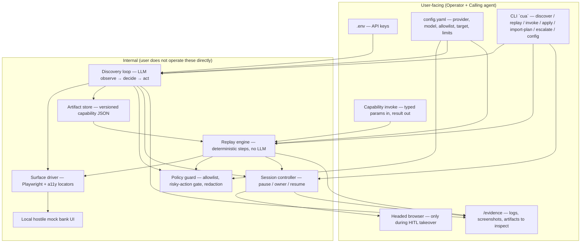

**Touches:** config, commands, capability I/O, HITL browser, evidence folder.  
**Doesn’t touch:** LLM prompts, locator resolution internals, redaction pipeline, step executor — those stay internal but documented.

---

## 3. End-to-end control flow

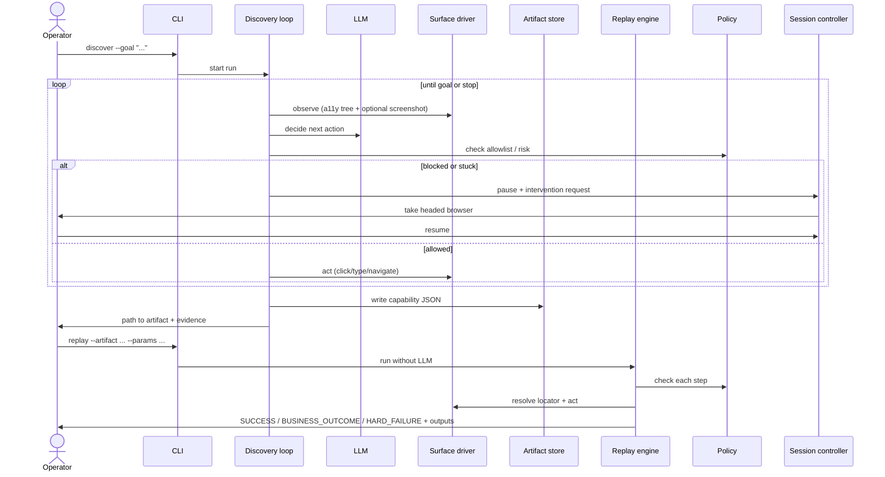

---

## 4. Capability as the agent-facing contract

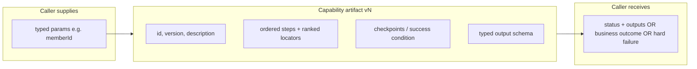

The calling agent never sees the discovery transcript — only this contract.

---

## 5. Session ownership (HITL)

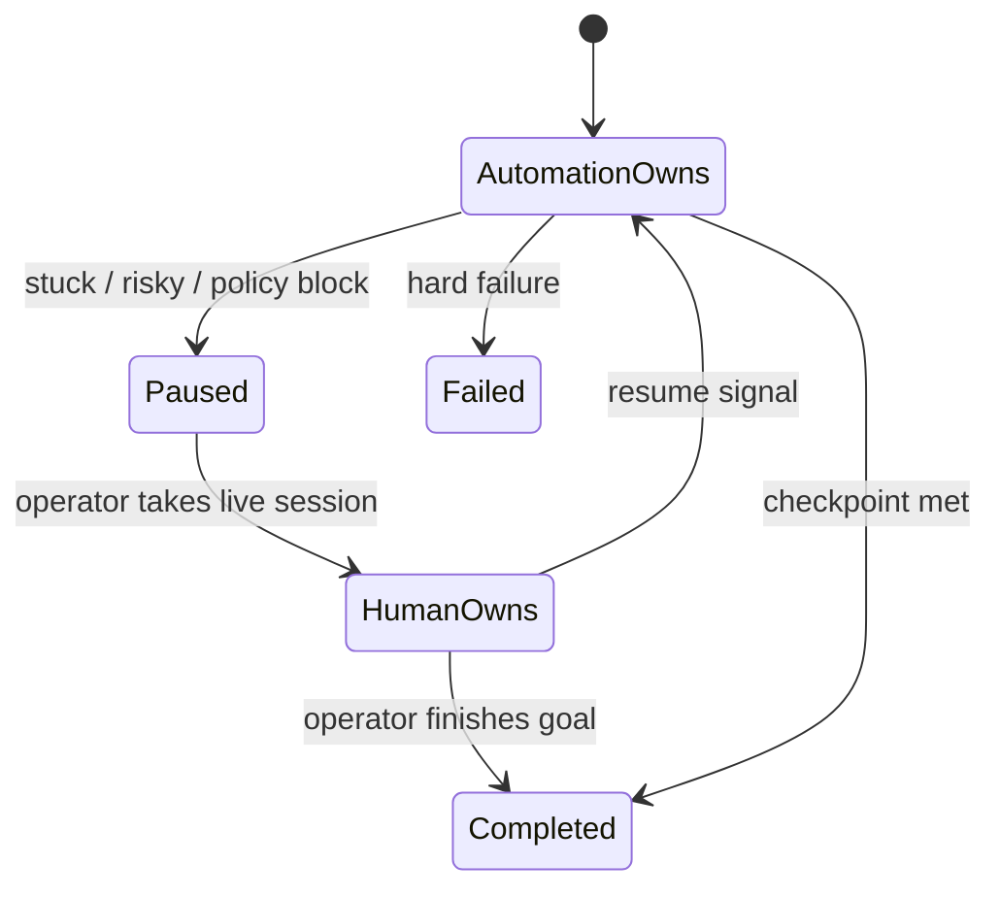

Same browser context across states. Control transfer is real; operator UI can stay minimal (headed window + CLI).

---

## 6. Module map

Names are intentional — rename only with a doc+diagram update.

| Module / path | Status | User-facing? | Responsibility |
|---|---|---|---|
| `src/cli/main.ts` | **S1+** | Yes | `cua` — discover / replay / **invoke** / escalate / config |
| `config.yaml` + `.env` | **S1** | Yes | Runtime knobs without redeploy |
| `src/config/` | **S1** | No | Zod schema; load/merge; `config set` |
| `src/artifact/` | **S3** | Partly | Capability Zod + load/save |
| `capabilities/` | **S3** | Yes | Saved capability JSON |
| `src/surface/` | **S4** | No | Ranked Playwright locator resolution |
| `src/replay/` | **S4** | No | Deterministic step engine |
| `src/policy/` | **S4** | No | Allowlist + risky gate |
| `src/discover/` | **S5+** | No | Observe → LLM locator emit; optional HITL note patch (`patch-locator.ts`) |
| `src/artifact/bindings.ts` | **S8** | No | `bindings` overlay: entryPath + target remaps |
| `src/artifact/fill-form.ts` | **G1** | No | Profile → field-map fill + verify + craft wake |
| `src/artifact/fill-receipt.ts` | **G1** | No | Redacted fill receipt + `valuesMatch` |
| `src/artifact/repair-field-map.ts` | **G1** | No | Observe → heuristic/LLM field-map repair |
| `src/artifact/form-outcomes.ts` | **G1** | No | Map fill failure detail → `form.*` codes |
| `src/artifact/profile.ts` | **G1** | No | Nested profile get/set + path flatten |
| `src/surface/observe-controls.ts` | **G1** | No | DOM control inventory for repair |
| `src/surface/detect-ats.ts` | **G1** | No | ATS family sniff (Ashby/GH/Lever/Workday) |
| `src/surface/greenhouse-boards.ts` | **G1** | No | Greenhouse boards-api enum hints |
| `src/surface/workday-widgets.ts` | **G1** | No | Workday multiselect / education widgets |
| `src/surface/page-errors.ts` | **G1** | No | Visible page-error scrape for outcomes |
| `apps/mock-core/member-lookup-beta/` | **S8** | Yes | Tenant Beta label skin (same API) |
| `src/session/` | **S6+P3** | Partly | HITL intervention / resume; opt-in action recorder (`record-actions.ts`) |
| `src/evidence/` | **S7** | No | Chapter helpers |
| `apps/mock-core/` | **S2** | Yes | Bank-ish UI + JSON-table API |
| `evidence/` | **S7** | Yes | Graded demo bag + live runs |
| `REPORT.md` | **S7** | Yes | Design write-up |


### S1 config merge (implemented)

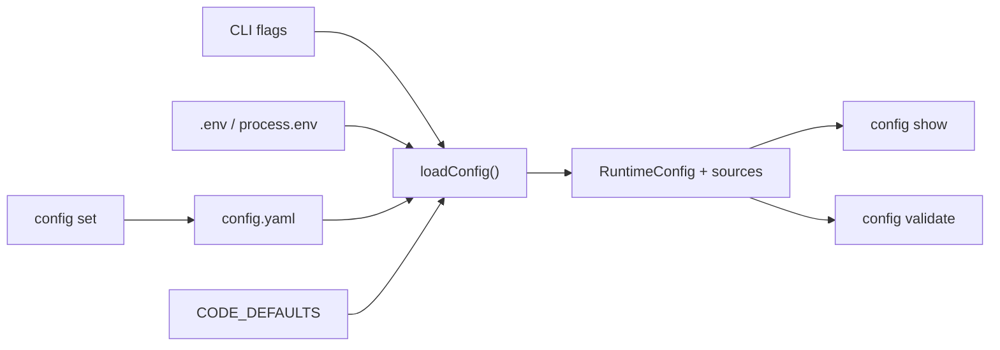

Precedence: CLI > env > `config.yaml` > code defaults. Lists **replace** from the winning layer. Secrets only via env; `config set` refuses `*API_KEY*` paths.

### S2 mock-core surface (implemented)

Full screen contract: [`docs/mock-core.md`](./mock-core.md).

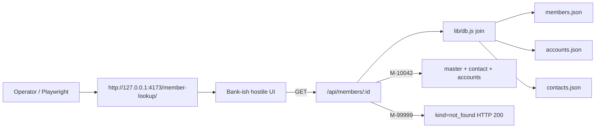

Serve with `npm run mock` — static files **plus** thin JSON-table API (no Postgres).
Slightly dynamic: API latency, `role=status`, footer clock, multi-account join.

---

## 7. Artifact schema (deep dive)

Full draft: [`docs/artifact-schema.md`](./artifact-schema.md).

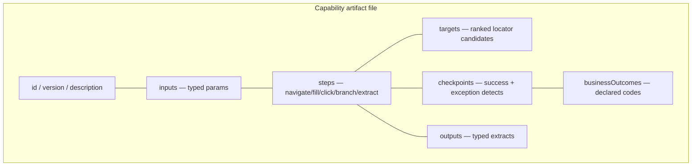

Calling agent sees **inputs + outputs + outcomes**. Operator may review the whole JSON. Discovery transcript stays in `/evidence/`, not inside the capability.

---

## 8. Config surface (deep dive)

Full draft: [`docs/config-surface.md`](./config-surface.md).

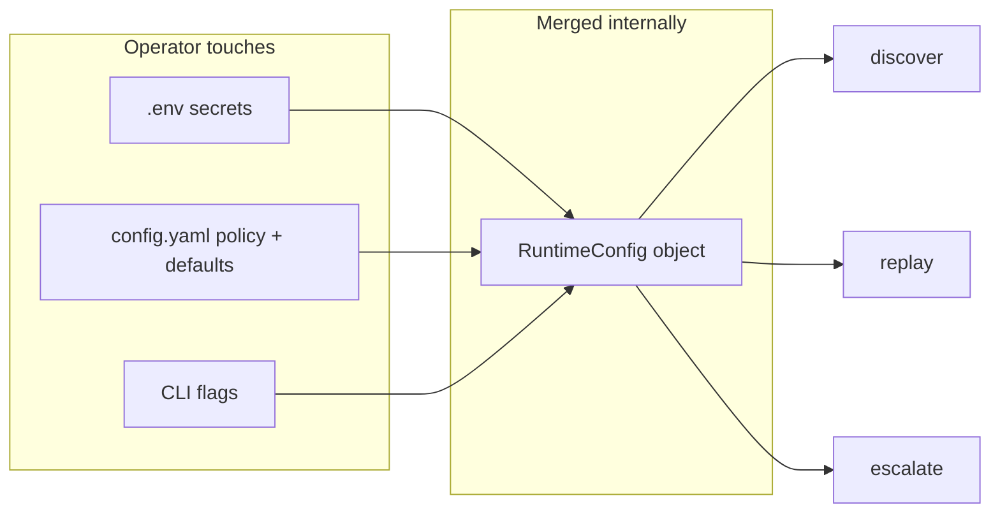

Precedence: CLI flags > env > `config.yaml` > code defaults.

---

## 10. Operator packaging + debug logging

**Not** a production platform — thin wrappers so anyone can train (discover) and run (replay).

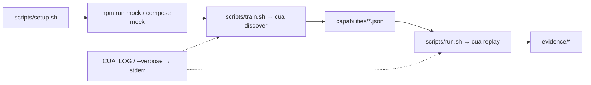

| Surface | Command |
|---|---|
| Setup once | `./scripts/setup.sh` |
| Train / save workflow | `./scripts/train.sh` (or `npm run train`) |
| Run saved workflow | `./scripts/run.sh M-10042` / `M-99999` |
| Full demo | `npm run demo:slice` |
| Docker mock | `docker compose up mock` |
| Docker slice | `docker compose run --rm cua` |

**Debug logging:** `CUA_LOG=debug` or `cua … --verbose` writes step breadcrumbs to **stderr** (stdout stays machine JSON). Evidence `run.json` remains the durable ledger.

---

## 10b. Bounded self-heal + tenant bindings (post-core)

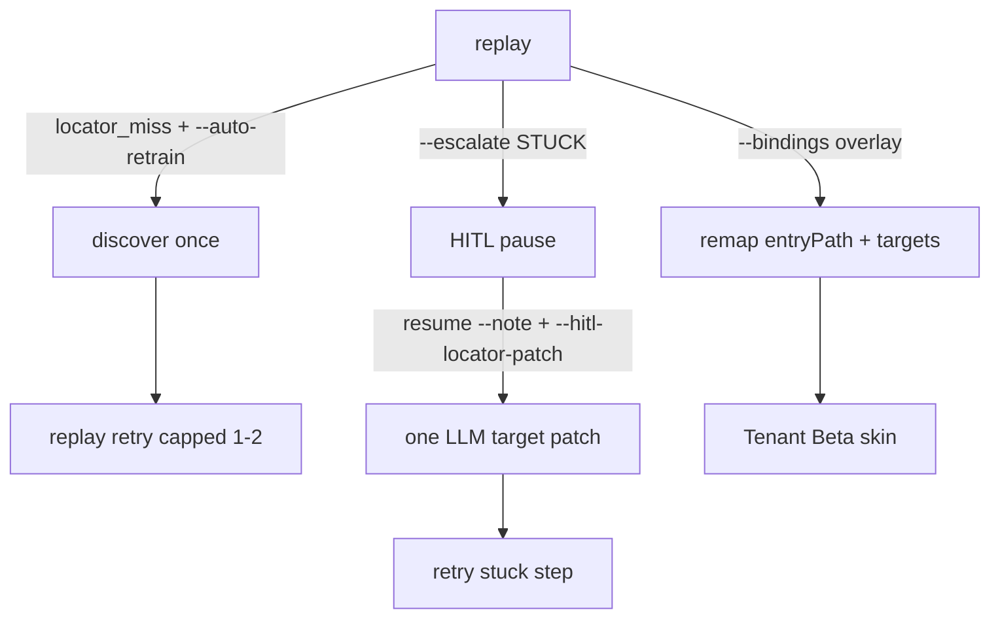

| Flag / path | Role |
|---|---|
| `--auto-retrain` | Opt-in capped re-discover on `locator_miss` |
| `--autonomous-repair` | P3 opt-in repair loop (max 5) |
| `--hitl-locator-patch` | Opt-in note→locator patch (still opaque clicks by default) |
| `--record-actions` | P3 opt-in HITL click→locator teach |
| `capabilities/bindings/tenant-beta.json` | S8 overlay |
| `/member-lookup-beta/` | Second mock skin |
| `cua invoke <id>` | S9 thin typed call (params in → replay result out) |

---

## 10c. G1 hybrid forms (post-`v0.1.0` — locked E6)

Additive. Does **not** replace §3 core mock flow.

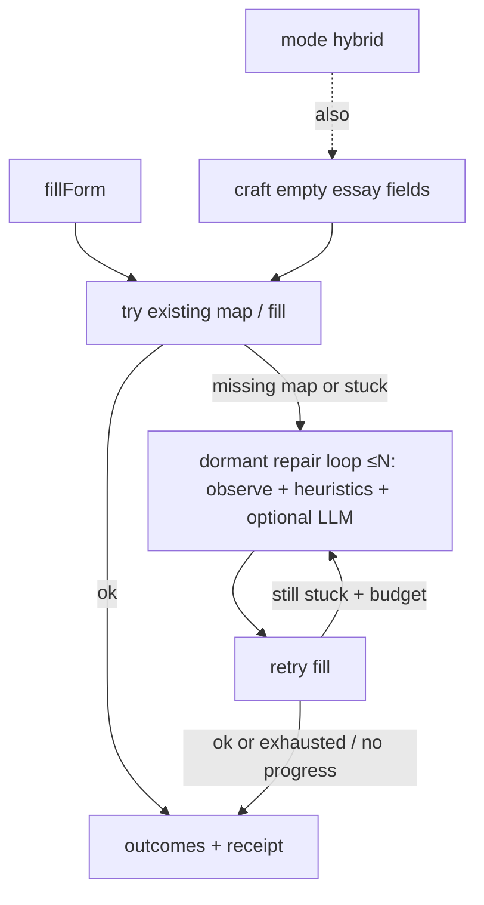

| Piece | Contract |
|---|---|
| `fillForm` step | Zod arm; `fieldMapRef` + profile; **preflight** all empty required profile paths (except craftable) before touching controls; skip optional; `field.UNMAPPED` / `field.VERIFY` / `form.*` if gap |
| Select snap | Observe captures option labels → `enumHints`; fill snaps profile value to live `<option>` / hints (exact → casefold → yes/no → contains). Greenhouse: optional boards-api `?questions=true` merges option labels onto empty select/combobox controls |
| Combobox / react-select | Open `.select__control`, type, pick option; verify via `.select__single-value` (input often stays empty) |
| Sponsorship polarity | Negated “without requiring sponsorship” → Yes when `flags.sponsorshipNo` truthy; positive “require sponsorship?” → `invertBool` so truthy maps to No |
| Profile aliases | `fullName` → `firstName`/`lastName` when split fields asked |
| Field-maps | `capabilities/field-maps/<id>.json` |
| Dormant repair loop (both modes) | Happy path = **0 LLM**. Stuck → repair+retry up to `--form-repair-max` (default **3**, hard cap **5**). Stops early if the same failure detail repeats (no progress). Persist with `--write-field-map`. Not unbounded G3. |
| Dormant craft LLM (both modes) | Wakes only for empty dynamic fields (`craft:llm`, required `answers.*` / textarea). Prompt includes **profile context** (secrets skipped). Cap ≈ `--form-repair-max`. Profile values still win when present. |
| `--mode hybrid` / `deterministic` | Same repair + craft dormancy; mode kept for CLI compat. Use **hybrid** when the map may be stale (Co C) or essays need craft; Co A/B happy path stays deterministic |
| Verify + receipt | After each fill, read-back verify; write `evidence/fill-receipt.json` (redacted). Optional `blocker` enum: `captcha\|closed\|widget\|missing_required\|verify`. Required mismatch → stuck repair |
| Repair few-shot | When repair LLM wakes, inject sibling green map fields + receipt keys for known `ats-family` (`docs/golden-forms.md`); hold-out skips self mapId; **`unknown` family gets no few-shot** (no demo-co-a default, G20) |
| Location verify | City/location autocomplete expansions match on city token (`New York, NY` ≈ `New York City…`) |
| Multipage | `fillFormFlow`: engine sets `allowLlm` on page 0 / stuck / retry; routine later pages use heuristics only; craft via per-arm `makeCraftAnswer` |
| `--write-field-map` | Opt-in persist repaired map to repo |
| `--form-repair-max` | Cap stuck repair iterations (1–5; default 3) |
| `--profile` | Invoke/replay context only; never inside Capability JSON (PII / reuse). `WORKDAY_EMAIL`/`PASSWORD` overlay at invoke time |
| `--record-har` | Opt-in `network.har` (bodies omit by default; evidence only — not fulfill) |
| `--har-on-failure` | With `--record-har`: delete HAR after success (retain on failure only) |
| `--trace-on-failure` | Playwright `trace.zip` under evidence only when the run fails |
| Live ATS | Ashby + Lever auto proven headless; Workday widgets + `fillFormFlow` validate-retry; auth via `session.storageStatePath`; ATS family → `evidence/ats-family.json` |
| Self-sufficiency | Dynamic shell + dormant repair/craft — capability factory, not always-on agent |
| `--escalate` (dormant HITL) | **Needed as last resort** (MFA, captcha, judgment, secrets). Off by default; with `--escalate`, pause after repair budget exhausted / policy block. Captcha/closed page text → `form.CAPTCHA` / `form.CLOSED`. Not every run. |
| Form outcome codes | `field.UNMAPPED` (missing required), `field.VERIFY`, `form.WIDGET`, `form.CAPTCHA`, `form.CLOSED` — same D3 outcome enum as bank mock |
| Demo | `npm run demo:reviewer` (core mock + Co A/B/C); Co A/B deterministic; Co C stale+extra hybrid |
| Templates | Optional `template` field — `docs/templates.md` |

Queue: `.scratch/capability-factory-general/ROADMAP.md`.

---

## 10d. G2 author-steps (unlocked)

Opt-in discover mode. Default discover stays **locators-only** into a code-owned skeleton.

```bash
cua discover --author-steps --goal "…" --out capabilities/experiments/authored-capability.json
```

LLM emits Zod-capped `steps` + `targets` (+ optional checkpoints/IO); one repair pass; evidence `author-steps.json`. Replay of the authored artifact is still deterministic (`llmCalls: 0` unless hybrid/HITL).

**Prove:** offline `fixtures/g2-authored-member-lookup.json` via `selfCheckAuthorSteps` (`check:forms`); optional live `npm run demo:author-steps`.

**Apply/ATS shortcut:** if the goal looks like apply and the page is an ATS family, emit a **dynamic shell** (`navigate → wait → fillFormFlow`) with **0 LLM** — field maps stay runtime-dynamic. Prefer this over long fixed fill/click chains.

**Reject:** free tool graphs (G3); LLM on every replay step; hand-maintained per-company step laundry lists.

---

## 11. Doc ↔ diagram rule

When you add or change a module:

1. Update this file (or add `docs/<module>.md` with Mermaid).
2. Add/adjust the file module docstring and public function docstrings in code.
3. Keep names identical across diagram labels, file paths, and symbols.

## Product track (Apply UI)

Operator guide: **`docs/APPLY.md`**. Status: `docs/PRODUCTIZE.md` / `docs/agents/map.md`. Locks: `DECISIONS.md` G1–G12.

### Bridge — plan → fill (G12)

Imported FieldMaps seed `fillFormFlow`; repair only adds gaps. Plan answers may live on FieldMap `literal` (treat maps with literals as private).

**Literal vs heuristic:** plan literals may win over *optional* survey owners sharing a CSS control; they never displace a *required* heuristic owner (hostile/stale plan). Pass-2 shadow drop never removes `required:true` map rows even when requiredness was undetected on the control owner (T-B-27); colliding plan literals on that selector are dropped instead (T-B-27b). Opaque unanswered plan keys coerce to `_plan.*` instead of aborting import (T-B-24). File fields always use profile `resumePath` (no plan literals; uploads are document extensions only under the repo realpath jail). `--out` write paths (import-plan + discover) realpath the nearest existing ancestor (T-B-25/T-B-29). `workAuth: "Yes"` normalizes to `Authorized`; bare Authorized/Yes does not imply `flags.sponsorshipNo` (T-B-28/T-B-28b).

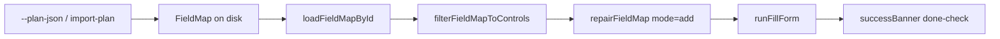

### Worker harden — live ATS honesty (post T-B-7)

Live Ashby Overview URLs returned SUCCESS with an empty receipt; vault `location` objects filled as `[object Object]`.

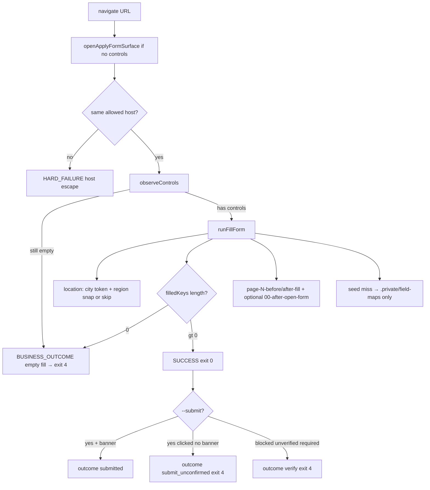

| Guard | Behavior |
|---|---|
| Location display | `getProfilePath('location')` formats `{city,region,country}` → `"City, Region, Country"` |
| Location typeahead | Needle `City, ST`; **require** whole-city token match (+ region when present); else skip/fail — no blind Enter |
| Empty fill | Never SUCCESS when `filledKeys` is empty (`fillForm` **and** `fillFormFlow`); receipt includes `failDetail` |
| Overview → form | Click Application / Apply (≤~2s poll, T-W-13); **re-assert host** against allowlist |
| Seed cache | Missing seed → write **`.private/field-maps/<id>.json`** only after verified fill (G16); `--write-field-map` → tracked |
| Submit claim | `outcome: submitted` only when confirmation text/banner observed; click without banner → `submit_unconfirmed` |
| Pre-submit | Unverified required keys in receipt → do not click Submit (G20) |
| Live wrapper | `apply-live.sh` → `node dist/cli/main.js`; always rewrite `resumePath` when resume copied |
| Page gallery | `fillFormFlow` writes `00-after-open-form` + `page-{N}-before/after-fill` under `screenshots/` + `screenshots-manifest.json` |

**Act-on locks (D0, 2026-09-13 reviews):** T-W-8 observe submit · T-W-9 fail-closed location · T-W-10 private seed cache · T-W-12 resume rewrite · T-W-14 origin check · T-W-15 local CLI. No tracked Maximor-specific `auto-ashby.json`.

| Surface | Module / CLI |
|---|---|
| Config overlay | `config.local.yaml` → `loadConfig` layer `local` |
| Profile | `normalizeApplyProfile` (vault hoist) + `--storage-state` |
| Import plan | `cua import-plan` → Zod PlanJson, aliases, `literal`, `surveyPlan`, `successBanner` |
| Page-filter | `filterFieldMapToControls` before repair (multipage perf) |
| Worker apply | `cua apply` + `worker-exit` codes; seed ≠ wipe; empty-fill fail; observed submit |
| Golden CI | `npm run check:golden` (incl. bridge-alias fixture) |
| HAR | Kept only under `evidence/private/` (or `CUA_ALLOW_PUBLIC_HAR=1`) |

Core mock + G1 forms remain frozen at tags `v0.1.0` / `v0.2.0`. Apply/train/G2 prove frozen at **`v0.3.0`**.

### Gen — flexible I/O bag (G13–G16)

| Piece | Behavior |
|---|---|
| Messy profile | Unknown top-level scalars → `answers.*` (`normalizeApplyProfile`) |
| Worker return | `gathered`: extracts + fill-receipt entries + `missingOutputs` + `submitVerified` |
| Form success | `fillForm` / `fillFormFlow` capabilities: page success checkpoint can SUCCESS even if some Capability `outputs[]` empty (gaps listed in message / gathered) |
| Submit | Confirmation banner ⇒ `submitted`; harvest light (empty `gathered.filled`) |
| Site FieldMap persist | G16 / T-G-5: `shouldPersistSiteFieldMap` — need ≥1 verified fill; if `--submit` clicked submit, also need `submitConfirmed`. Evidence `field-map-proposed*` uncapped. |
| Submit proof (G17) | `extractSubmitProof` → `gathered.confirmationText` / `confirmationReference`; `submitVerifyState`; click without banner → `submit_unconfirmed` |
| Profile shape (G18) | `prepareApplyProfile` keeps raw+normalized clones; evidence `profile-shape.json` keys only; worker `phases` |
| Soft optional + family confirm (G19) | Empty optionals → `skippedOptional`; required gaps → `missingRequiredPaths`; confirm regex/phrases via AtsFamily adapters |
| Pre-submit gate (G20) | `--submit` refuses click if required keys in receipt are unverified; unknown family has no demo few-shot |
| Not in scope | Unbounded any-website explore (G3) |

### Factory cleanup — one LLM door, dual fill arms, shared CLI runner

Post-`v0.4.0` hygiene (map T-F-*). **Do not** merge `fillForm` / `fillFormFlow` schemas. Repair LLM gate is an explicit `allowLlm` flag from the engine (no `/fillFormFlow page/` reason sniff). Craft budgets are **per arm** via `makeCraftAnswer`. Deterministic heuristics live in pure `inferFieldMap`; observation + LLM stay in `repairFieldMap`.

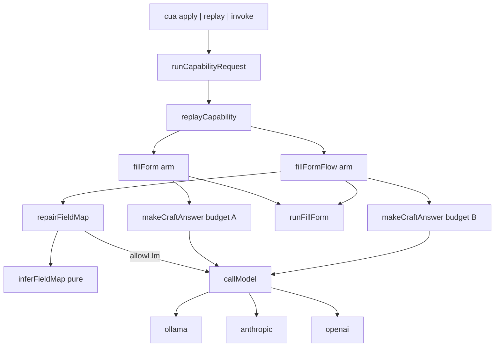

| Module | Role |
|---|---|
| `src/llm/call-model.ts` | Provider-neutral `callModel` + `callOllamaJson`; never throws; CI stubs need no cloud keys |
| `src/artifact/craft-answer.ts` | `makeCraftAnswer({ budget })` — one budget per factory instance |
| `src/artifact/infer-field-map.ts` | Pure control→field heuristics |
| `src/artifact/repair-field-map.ts` | Observe + merge + optional LLM (`allowLlm`) |
| `src/cli/run-capability-request.ts` | Shared replay + `result.json` (+ optional `worker.json`); no `process.exit` |
| Engine helpers | `persistFillReceipt`, `fillNow`, `pauseHitl`; Workday via `tryFillWorkdayField` |

**Live matrix (fill-only, gitignored):** Ashby Maximor exit 0; Lever 100ms exit 0; Greenhouse Figma still `field.VERIFY` (location widget) — allowlisted, not a code gate.