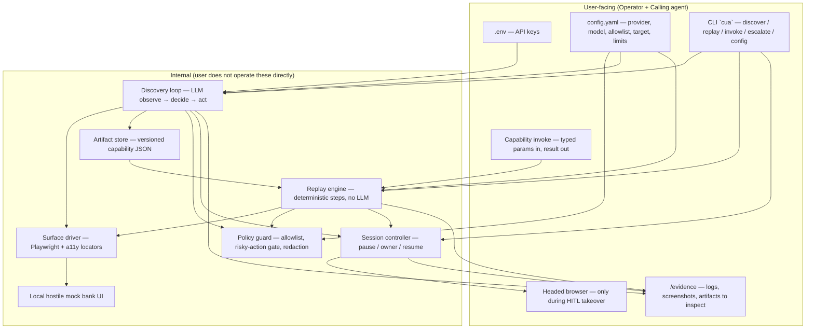
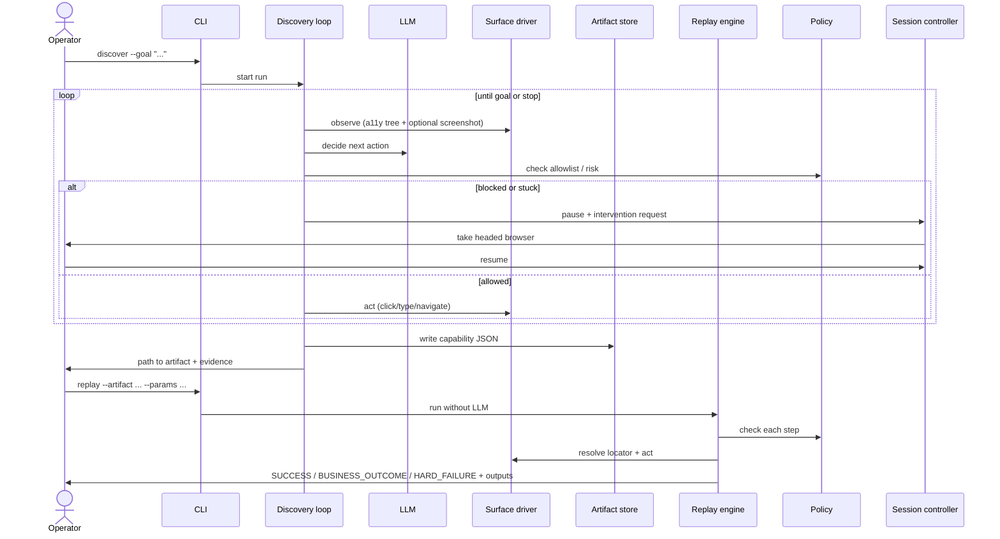
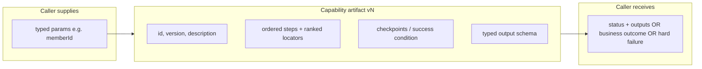
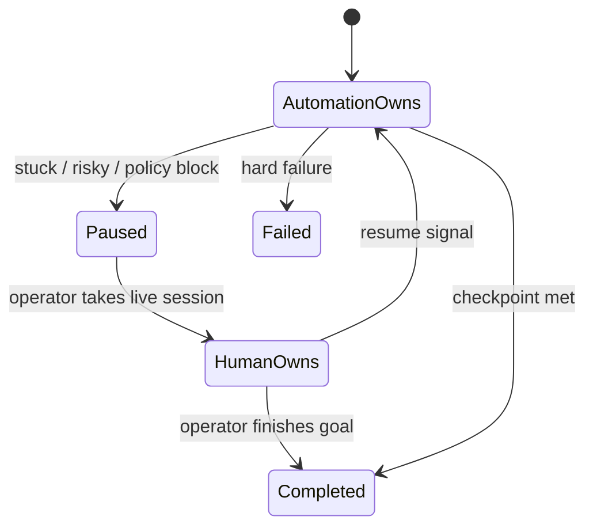
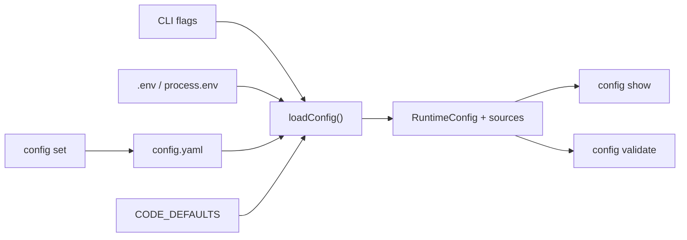
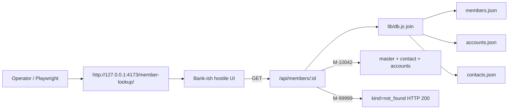
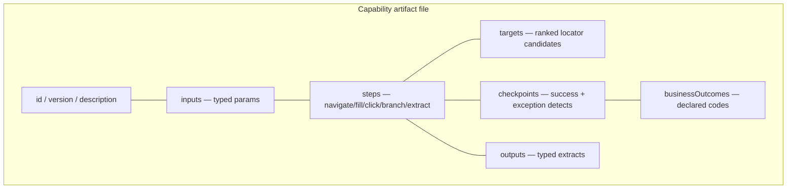
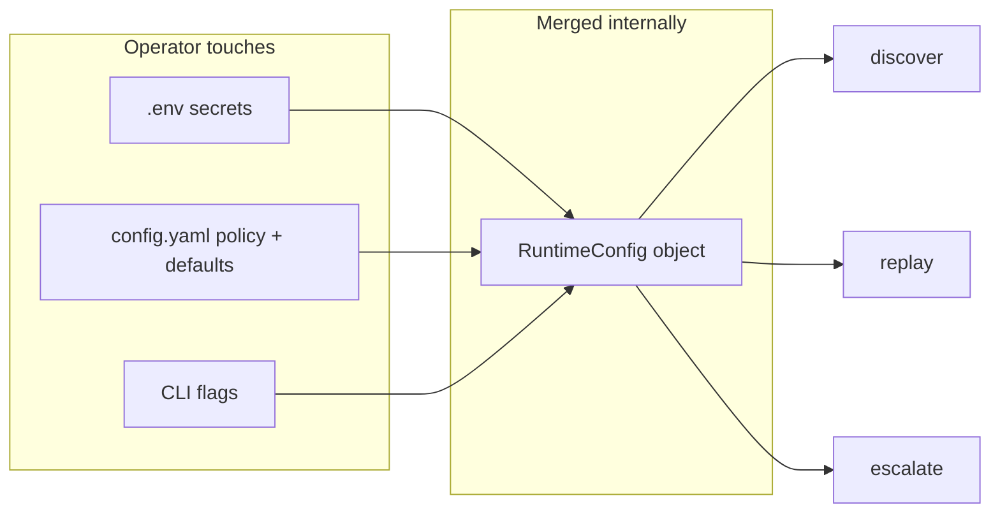
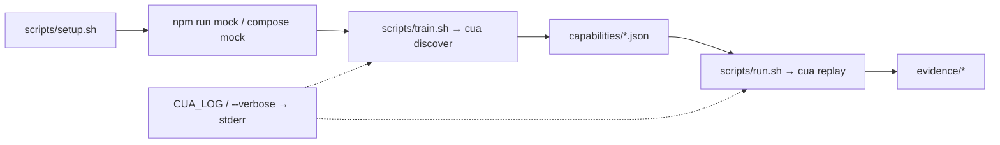
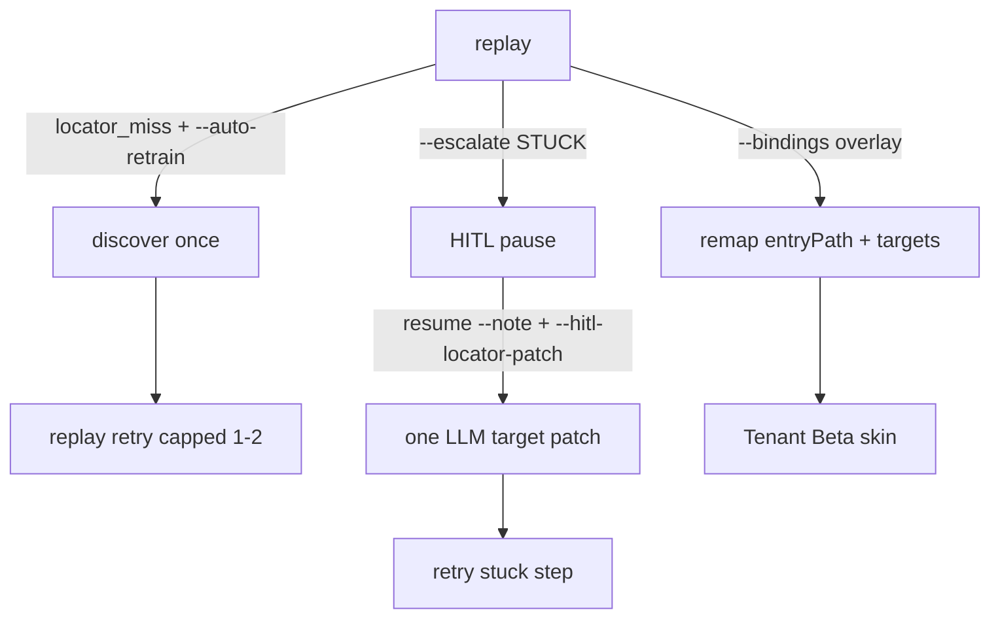

# Architecture map — user-facing vs internal

**Rule:** Design and document *before* implementing a module. Every module gets a Mermaid view in this file (or a linked doc) in the same change as the code. Docs and diagrams stay parallel — if the code changes, the diagram changes in the same PR/commit.

See also: `DECISIONS.md`, `docs/artifact-schema.md`, `docs/config-surface.md`, `docs/mock-core.md`, `docs/hitl-contract.md`, `docs/evidence-layout.md`, coding standards in `CLAUDE.md`.

---

## 1. Who is “the user”?

Three personas. Only the first two *touch* anything in v1:

| Persona | Role | Touches |
|---|---|---|
| **Operator** | Human running the project / HITL | CLI, `.env`, `config.yaml`, headed browser when escalated |
| **Calling agent** | Upstream AI that invokes a capability | Capability contract (JSON in/out) — CLI stand-in for now |
| **System** | Discovery, replay, policy, session | Invisible; only evidence/logs when debugging |

Operators use the CLI / HITL path.

---

## 2. What the user touches vs what they don’t see

**Touches:** config, commands, capability I/O, HITL browser, evidence folder.  
**Doesn’t touch:** LLM prompts, locator resolution internals, redaction pipeline, step executor — those stay internal but documented.

---

## 3. End-to-end control flow

---

## 4. Capability as the agent-facing contract

The calling agent never sees the discovery transcript — only this contract.

---

## 5. Session ownership (HITL)

Same browser context across states. Control transfer is real; operator UI can stay minimal (headed window + CLI).

---

## 6. Module map

Names are intentional — rename only with a doc+diagram update.

| Module / path | Status | User-facing? | Responsibility |
|---|---|---|---|
| `src/cli/main.ts` | **S1+** | Yes | `cua` — discover / replay / **invoke** / escalate / config |
| `config.yaml` + `.env` | **S1** | Yes | Runtime knobs without redeploy |
| `src/config/` | **S1** | No | Zod schema; load/merge; `config set` |
| `src/artifact/` | **S3** | Partly | Capability Zod + load/save |
| `capabilities/` | **S3** | Yes | Saved capability JSON |
| `src/surface/` | **S4** | No | Ranked Playwright locator resolution |
| `src/replay/` | **S4** | No | Deterministic step engine |
| `src/policy/` | **S4** | No | Allowlist + risky gate |
| `src/discover/` | **S5+** | No | Observe → LLM locator emit; optional HITL note patch (`patch-locator.ts`) |
| `src/artifact/bindings.ts` | **S8** | No | `bindings` overlay: entryPath + target remaps |
| `apps/mock-core/member-lookup-beta/` | **S8** | Yes | Tenant Beta label skin (same API) |
| `src/session/` | **S6** | Partly | HITL intervention / resume files |
| `src/evidence/` | **S7** | No | Chapter helpers |
| `apps/mock-core/` | **S2** | Yes | Bank-ish UI + JSON-table API |
| `evidence/` | **S7** | Yes | Graded demo bag + live runs |
| `REPORT.md` | **S7** | Yes | Design write-up |

### S1 config merge (implemented)

Precedence: CLI > env > `config.yaml` > code defaults. Lists **replace** from the winning layer. Secrets only via env; `config set` refuses `*API_KEY*` paths.

### S2 mock-core surface (implemented)

Full screen contract: [`docs/mock-core.md`](./mock-core.md).

Serve with `npm run mock` — static files **plus** thin JSON-table API (no Postgres).
Slightly dynamic: API latency, `role=status`, footer clock, multi-account join.

---

## 7. Artifact schema (deep dive)

Full draft: [`docs/artifact-schema.md`](./artifact-schema.md).

Calling agent sees **inputs + outputs + outcomes**. Operator may review the whole JSON. Discovery transcript stays in `/evidence/`, not inside the capability.

---

## 8. Config surface (deep dive)

Full draft: [`docs/config-surface.md`](./config-surface.md).

Precedence: CLI flags > env > `config.yaml` > code defaults.

---

## 10. Operator packaging + debug logging

**Not** a production platform — thin wrappers so anyone can train (discover) and run (replay).

| Surface | Command |
|---|---|
| Setup once | `./scripts/setup.sh` |
| Train / save workflow | `./scripts/train.sh` (or `npm run train`) |
| Run saved workflow | `./scripts/run.sh M-10042` / `M-99999` |
| Full demo | `npm run demo:slice` |
| Docker mock | `docker compose up mock` |
| Docker slice | `docker compose run --rm cua` |

**Debug logging:** `CUA_LOG=debug` or `cua … --verbose` writes step breadcrumbs to **stderr** (stdout stays machine JSON). Evidence `run.json` remains the durable ledger.

---

## 10b. Bounded self-heal + tenant bindings (post-core)

| Flag / path | Role |
|---|---|
| `--auto-retrain` | Opt-in capped re-discover on `locator_miss` |
| `--hitl-locator-patch` | Opt-in note→locator patch (still opaque clicks) |
| `capabilities/bindings/tenant-beta.json` | S8 overlay |
| `/member-lookup-beta/` | Second mock skin |
| `cua invoke <id>` | S9 thin typed call (params in → replay result out) |

---

## 11. Doc ↔ diagram rule

When you add or change a module:

1. Update this file (or add `docs/<module>.md` with Mermaid).
2. Add/adjust the file module docstring and public function docstrings in code.
3. Keep names identical across diagram labels, file paths, and symbols.
