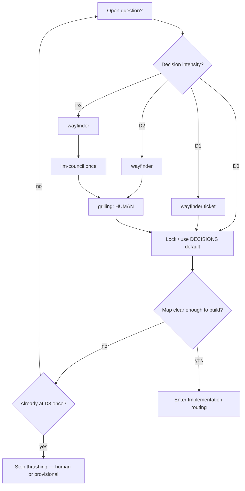
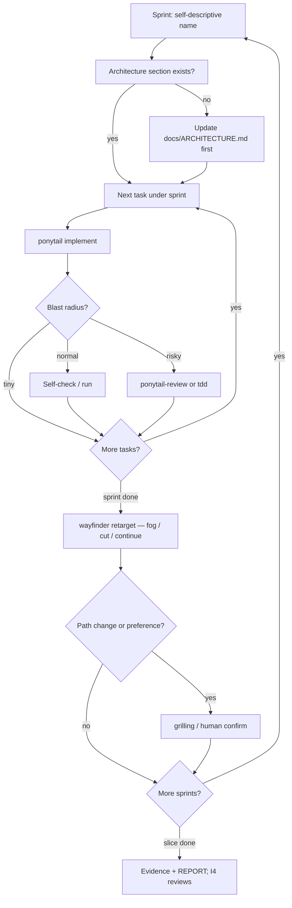

# Skills playbook — project overlay

**This file specializes [`agent-os/`](../../agent-os/README.md) for the computer-use project.**  
Universal routers: `agent-os/PLAYBOOK.md` · factory desk: `agent-os/FACTORY.md` · PRD intake: `agent-os/FROM-PRD.md` · capabilities: `agent-os/CAPABILITIES.md` · install: `agent-os/TOOLING.md` · setup: `agent-os/SETUP.md`.

`CLAUDE.md` points here for **project** phase/sprint detail. Prefer this overlay + agent-os over inventing a new process.

Read with: `DECISIONS.md`, `docs/ARCHITECTURE.md`, `docs/PRODUCTIZE.md`, tracked map `docs/agents/map.md`.

---

## Default posture

1. **Decisions first** → climb **decision intensity** (D0–D3); human via grilling when preference/irreversible.  
2. **Design before code** → Mermaid + prose in `docs/` in the same change as modules.  
3. **Build via implementation routing** → named sprints + intensity I0–I4 (not review-everything).  
4. **Build thin / decide thin** → ponytail + anti-thrash (one council max per fork).  
5. **Prove** → evidence chapters + browser/webapp testing, not screenshots alone.  
6. **Tooling is installed** — see `docs/agents/tooling-ready.md` + `agent-os/TOOLING.md`. Do not run every tool every turn.

---

## Phase matrix (this project)

| Phase | Goal | Use these | Do not use |
|---|---|---|---|
| **0 Orient** | Understand repo + product track | Read `DECISIONS.md`, `CONTEXT.md`, `docs/PRODUCTIZE.md`, this file | Implementing features |
| **1 Decide** | Lock open questions | **wayfinder**, **grilling** / **grill-me**, **domain-modeling**, **llm-council** (expensive forks only) | Coding, gstack, Graft |
| **2 Design** | Surfaces + contracts | Update `docs/ARCHITECTURE.md` + linked docs; **archify** only if diagrams need a dedicated pass | Product UI frameworks |
| **3 Build** | Vertical slice | **Implementation routing** + **ponytail** (`full`); Matt **implement** / **tdd**; **pstack** `/how` for gnarly modules | Breadth features; review-everything-after-every-task |
| **4 Prove** | Discovery + replay + HITL evidence | **webapp-testing**, Cursor browser tools; Ollama/cloud per config | Fake evidence |
| **5 Harden** | Diff / security / over-build | **ponytail-review**, **critic**, optional **security-threat-model** (light) | Full CSO theater |
| **6 Write-up** | `REPORT.md` / README | **doc-coauthoring**, **critic**; paste from `docs/report-heterogeneity-outline.md` | Inflating claims |
| **7 Optional polish** | Only after slice works | **graphify** once `src/` is real; **gstack** `/review` `/qa` if user wants; **humanizer** for prose | Graft unless agent context is painful |

---

## Skill catalog (installed / available)

### Always-on for this repo (process)

| Skill / doc | When |
|---|---|
| `docs/agents/issue-tracker.md` | Any wayfinder / ticket work |
| `docs/agents/triage-labels.md` | Triage status on markdown issues |
| `docs/agents/domain.md` | Before inventing domain terms |
| **wayfinder** | Chart or work decision tickets (one ticket per session unless research) |
| **grilling** / **grill-me** | HITL decision tickets; never answer for the human |
| **domain-modeling** | With grilling when glossary/ADR terms shift |
| **llm-council** | High-stakes forks (schema, HITL, naming clashes). Not for trivia |

### Build discipline

| Skill | When |
|---|---|
| **ponytail** | Every coding session in this repo (default `full`) |
| **ponytail-review** | Before PR / submission on the diff |
| **ponytail-audit** | If the tree feels bloated mid-project |
| **pstack** / **poteto-mode** | Multi-model build, `/how` before gnarly modules, `/arena` on design forks still open in code |
| **setup-pstack** | Only to change `~/.cursor/rules/pstack-models.mdc` |
| Matt **implement** | Executing a settled ticket / locked design |
| Matt **tdd** | Pure calc / outcome classifiers (`replay` status math) |
| Matt **research** | External API/docs facts (AFK wayfinder research tickets) |
| Matt **prototype** | Cheap artifact to react to before locking UX |

### Prove / QA

| Skill / tool | When |
|---|---|
| **webapp-testing** | Drive mock-core + CLI flows |
| Cursor **browser** MCP | Visual HITL / demo verification |
| **computer-use** (Codex/agents, if invoked) | Optional discovery experiments — product replay stays Playwright |

### Write / review

| Skill | When |
|---|---|
| **doc-coauthoring** | `REPORT.md`, README polish |
| **critic** | Adversarial pass on REPORT claims vs evidence |
| **humanizer** | Optional — strip AI-sounding prose in write-up |
| **multi-lens-review** | Optional pre-submit review |
| **security-best-practices** / **security-threat-model** | Light pass on allowlist, redaction, secret handling |

### Knowledge / codebase memory (optional)

| Skill | When |
|---|---|
| **graphify** (`/graphify`) | After substantial `src/` exists; map modules ↔ docs |
| **Graft** | Not default — only if user asks or context thrash is bad |
| **gstack** | Not default — optional `/qa` `/review` before a milestone review |

### Explicitly out of band for this project core

| Skill family | Why skip |
|---|---|
| Design taste / imagegen / pptx / docx / resume | Wrong deliverable |
| **mcp-builder** | No new MCP product required |
| Disabled frontend packs | Not the scored surface |

---

## Decision routing (don’t miss forks)

**Human is required** for preference locks and irreversible forks. Agents never silently invent those. Tools **stack by intensity** — they are not “run everything every time.”

| Role | Job |
|---|---|
| **wayfinder** | Frame the question as a ticket + keep the map honest |
| **llm-council** | When wrong answer is expensive: surface options + tradeoffs (not a final pick) |
| **grilling** | Force a **human** choose among clarified options; never answer for the human |
| **ponytail** | After lock: anti-**overengineering** (thin code) |
| **Timebox / defaults** | Anti-**overthinking** — process YAGNI |

### Decision intensity (pick one rung — do not climb past need)

| Rung | When | Do |
|---|---|---|
| **D0 Default** | Reversible + already in `DECISIONS.md` | Ship the default; no ticket theater |
| **D1 Frame** | New but low stakes | wayfinder ticket → Answer → map |
| **D2 Grill** | Preference / taste / naming | wayfinder → **grilling (HUMAN)** → lock |
| **D3 Council+Grill** | Expensive or irreversible fork | wayfinder → **one** llm-council → grilling → lock |
| **D4 Stop** | Still foggy after D3 | Human picks or provisional; **no second council** |

**Rejected (anti-pattern):** council + wayfinder on *every* question. That is overthinking dressed as rigor. Council is for forks where rewrite cost is high (schema, HITL, outcomes), not trivia.

### Anti-overthinking vs anti-overengineering

| Failure mode | Who stops it | Rule |
|---|---|---|
| **Overengineering** | **ponytail** | YAGNI → reuse → stdlib → native → dep → minimum code |
| **Overthinking** | **This playbook + human** | Climb **one** decision rung; max **one** council + **one** grill per fork; no Graft/gstack into Decide |

---

## Implementation routing (build without ceremony bloat)

Decision routing finds the path. **Implementation routing** walks it. Same rule: intensity scales with blast radius — not “all review tools after every subtask.”

### Named delivery sprints (self-descriptive — never “Sprint 1” / “Foundation”)

Use outcome names tied to the vertical slice. Default sequence for this project:

| Sprint id | Name | Done when |
|---|---|---|
| S1–S9 | **Core slice (done)** | See git tags `v0.1.0` / `v0.2.0` — do not reopen for product work |
| P0 | **Hygiene** | Ignore rules + PRODUCTIZE/map current |
| P1 | **Live-Hosts-and-Profile** | `config.local.yaml` merge + profile/storageState; **ACTIVE** |
| P2 | **Import-Plan-to-FieldMap** | `cua import-plan` + fill shell |
| P3 | **Captcha-Submit-Ladder** | escalate + `--submit` + exit codes |
| P5 | **Apply-CLI** | `cua apply` one-liner |
| P4 | **Harden-Selectors** | Rank-1 name/label; sniff after navigate |
| R | **Reliability-Fixtures** | Local CAPTCHA/CLOSED fixtures |
| H | **Hardening-Hour** | ≤1h leftovers |
| P6 | **Maintain** | Split/CI only after P5 |
| G2 | **Non-apply author-steps** | Parked (DECISIONS G8) |

Full checklists: `docs/PRODUCTIZE.md`. Tickets: `docs/agents/map.md`. Tasks = checklist under the sprint. **Do not** invent epics/OKRs.

### Implementation intensity (per task / sprint)

| Rung | When | Do |
|---|---|---|
| **I0 Ship** | Tiny, reversible edit | ponytail → code → smoke |
| **I1 Task close** | Normal task inside sprint | ponytail → implement → **self-check** (run it / one assert) → update map checkbox |
| **I2 Risky task** | Schema, replay classifier, secrets, allowlist | I1 + **ponytail-review** (or Matt tdd on pure calc) |
| **I3 Sprint close** | Sprint “Done when” met | **Retarget:** wayfinder map refresh (open fog? cut scope?) + thin evidence note; **human** if path should change |
| **I4 Slice / release** | Milestone (e.g. after P5) | multi-lens-review **or** critic + optional gstack `/review`; **not** all three stacked |

### What we deliberately do **not** do

| Proposal | Verdict | Why |
|---|---|---|
| wayfinder + llm-council on **every** question | **No** | D0–D3 already scale; universal council = thrash |
| multi-lens + code-review + council after **every** task | **No** | I1/I2 ladder; stack only at I4 |
| wayfinder+council retarget after **every** sprint | **Partial** | **wayfinder retarget yes (I3)**; council only if a new expensive fork appeared |
| Retarget more often mid-sprint | **Only if** | Discovery broke assumptions, blocked >~1h, or human changed goals |
| Deep task → subtask trees for ceremony | **No** | Flat checklist under named sprint; ponytail deletes fluff |

### Human in implementation

Ask the human when: preference lock, irreversible schema/HITL change, sprint retarget that **cuts** a promised demo path, or agent is stuck after **research dig + one recovery** (see below). Otherwise keep shipping against the locked map.

### Stuck → research dig (aggressive — this project)

When blocked on live ATS widgets / multipage / auth (**≳20–30 min** same bug) **or** human says dig into public examples:

1. Raid local notes/clones under `.scratch/research-clones/` / `.scratch/research-notes/` (gitignored).  
2. Reuse selectors / auth `storageState` / education+resume sequences / per-page validate — **do not** vendor LLM agent loops.  
3. Port into capability factory; prove headless.  
4. Keep keep-vs-reject notes **local only** — do not commit third-party project catalogs to `docs/`.

Universal playbook already has this section — **this overlay makes it mandatory for ATS work**, not optional.

### Modularity (reuse without library theater)

**Yes — modular inside the repo.** Keep clear seams that already appear in `docs/ARCHITECTURE.md`: config, policy, surface/Playwright, discovery, artifact, replay, session/HITL, mock-core. Prefer pure functions at those seams (especially cost/outcome math) so we can reuse *within* this project.

**No premature SDK extraction.** Extracting publishable packages or a “generic computer-use SDK” is overengineering for current scope (ponytail + time box). If a boundary is clean, extract later; that is not a v1 goal.

Rule of thumb: **module folders/files with boring imports** > **premature npm packages**. Reuse = clear names + one job per module, not max abstraction.

1. **Definition of done per sprint** — the table above; don’t “feel done.”  
2. **Docs ship with code** — same change as the module (`CLAUDE.md` rule).  
3. **Evidence as you go** — drop screenshots/logs into the right `/evidence/` chapter when the sprint produces them; don’t batch-fiction at the end.  
4. **One open build ticket at a time** (wayfinder discipline) unless AFK research.  
5. **Provisionals expire** — confirm or accept before the sprint that depends on them.  

---

## How we work (this project)

### Start (human)

Say one of:

- `Start S1 Scaffold-CLI-and-Runtime-Config — ponytail full`
- `Continue from progress.html — next incomplete core sprint`

Agent: read `DECISIONS.md` + `progress.html` `#progress-state` → implement that sprint only → update progress JSON when done.

### Parallel agents?

**Default: no.** S1→S7 are sequential dependencies (CLI → mock → artifact → replay → discover → HITL → evidence). Parallel workers on the same tree will thrash.

**OK to parallel later only if** two tasks touch **disjoint paths** (e.g. REPORT prose vs evidence screenshots) and each uses a **local branch**.

### Branches (all local — no push until submit)

| Mode | Branching |
|---|---|
| Normal (recommended) | Stay on `main` (or one `dev` branch); small sequential commits |
| Rare parallel | `git checkout -b sprint/S7-report` etc.; merge locally when done |

- **Do not** push feature branches for collaboration theater.  
- **Push** only when creating/updating the **public submit** remote (near the end).  
- Prefer **rebase or merge to local main** yourself; agents should not force-push.

### Commits

- **Dynamic, but frequent enough to undo:** after each sprint “Done when,” or after a coherent chunk that runs.  
- **Human asks to commit** (or says “commit S3”) — agents follow the repo commit rules; don’t spam empty commits.  
- Message = why (e.g. `feat: add cua config show/validate/set`).  
- Never commit secrets, `progress.html`, or `.env`.

### Mid-flight changes

Yes — retarget via wayfinder / update `DECISIONS.md` / flip sprint in `progress.html`. Don’t invent a new process; cut stretch (S8/S9) first if time is tight.

### Merge conflicts

If parallel was used: finish one branch → merge to main → run the demo path → then merge the second. No GitHub PR required for local-only work.

---

## Session start checklist (agents)

1. Read `DECISIONS.md` (locked choices).  
2. Read this playbook (phase + which **decision** / **implementation** rung).  
3. Check wayfinder map: any open/claimed tickets? Which **named sprint** are we in?  
4. If building: confirm architecture section exists for the module.  
5. Activate **ponytail full** for code.  
6. Never persist secrets; never claim multi-tenant/desktop shipped.
7. Optional local progress clock: open / edit gitignored `progress.html` (`#progress-state` JSON) when closing a sprint or logging focused hours.

---

## Human confirms

F3 (Zod) and F4 (`computer-use-automation` / `cua`) **locked** 2026-09-11. No open provisionals.

---

## Maintenance

When adding a skill to the **universal** kit: update `agent-os/TOOLING.md` + `agent-os/PLAYBOOK.md` if routing changes.  
When adding a **project-only** skill/sprint: update **this overlay** and the one-line pointer in `CLAUDE.md`.  
Do not duplicate long skill text into `CLAUDE.md`.
