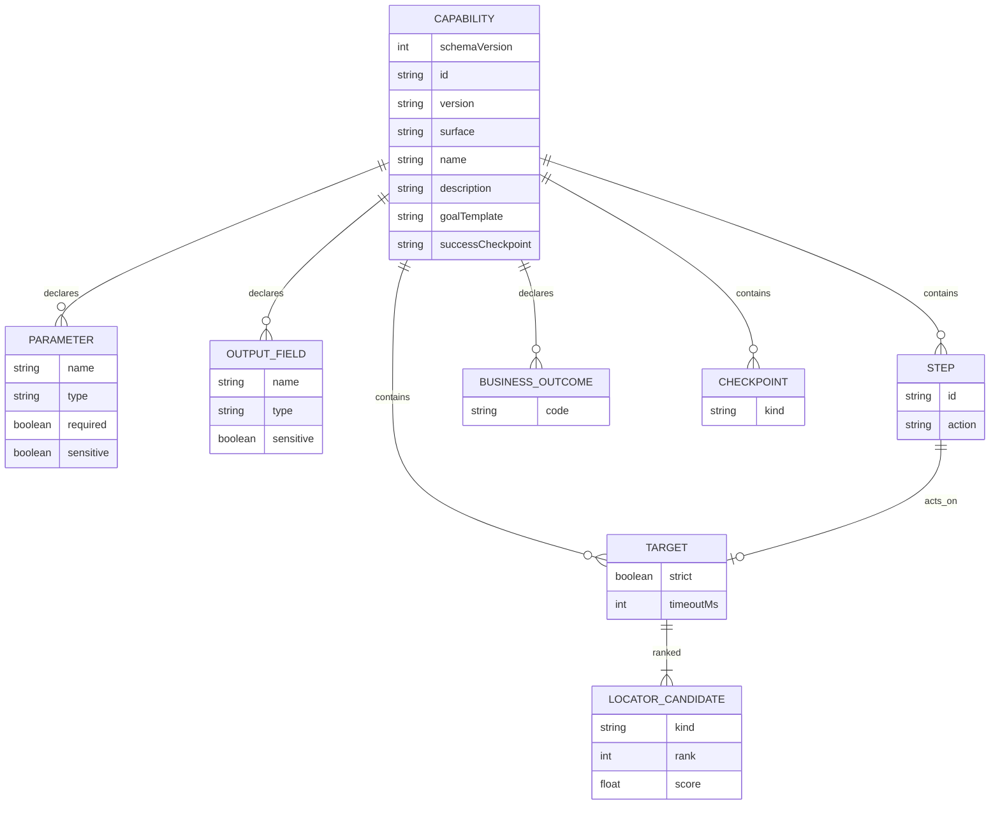
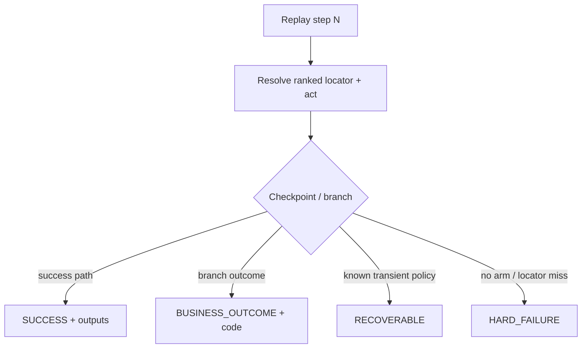

# Artifact schema (LOCKED v1)

**Status:** Locked via wayfinder ticket [Lock capability artifact JSON schema](../.scratch/computer-use-automation/issues/01-lock-capability-artifact-schema.md) after council (ACCEPT WITH EDITS).

**User-facing:** capability JSON under `capabilities/`.  
**Internal:** discovery write path + replay interpreter.

---

## Audience split

| Audience | Reads |
|---|---|
| Calling agent / Operator invoke | `id`, `version`, `inputs`, `outputs`, `businessOutcomes` codes |
| Human reviewer | above + `name`, `description`, `goalTemplate` |
| Replay engine | `steps`, `targets`, `checkpoints`, `successCheckpoint` |

---

## Entity relationship



---

## Closed enums

- **surface:** `web` (reserved later: `desktop`)
- **action:** `navigate` | `fill` | `fillForm` | `click` | `extract` | `branch` | `wait`  
  - `fillForm` (G1): `{ fieldMapRef }` → `capabilities/field-maps/<id>.json` + `--profile`; see `docs/ARCHITECTURE.md` §10c
- **locator kind:** `role` | `label` | `placeholder` | `altText` | `title` | `text` | `testId` | `css`
- **checkpoint kind:** `visible` | `hidden` | `url` | `textIncludes` | `allOf` | `anyOf`
- **branch when:** `{ "checkpoint": "<checkpointKey>" }` only — no free-string DSL
- **branch arm:** `{ when, next }` OR `{ when, outcome }` — first match wins; none → `HARD_FAILURE`
- **Run result (engine, not artifact):** `SUCCESS` | `BUSINESS_OUTCOME` | `RECOVERABLE` | `HARD_FAILURE`

---

## Control-flow owner (single)

1. Steps execute in order until `branch`.
2. `branch` evaluates arms in order against checkpoints.
3. `outcome` codes must exist under `businessOutcomes[]`.
4. `businessOutcomes[].detect` is documentation for humans; **runtime detection is only via `branch` arms** (avoids dual authority).
5. Terminal success = reach `successCheckpoint` and fill all non-optional outputs.

Checkpoints that assert UI **must** use a `target` `$ref` into `targets` (ranked locators). Inline css-only checkpoints are forbidden in v1.

---

## Capability shape (canonical example)

```json
{
  "schemaVersion": 1,
  "id": "lookup-member-savings-balance",
  "version": "1.0.0",
  "surface": "web",
  "name": "Lookup member savings balance",
  "description": "Search member by ID and read savings balance on detail screen.",
  "goalTemplate": "Look up member {{memberId}} and read their current savings balance",
  "bindings": {},
  "inputs": [
    { "name": "memberId", "type": "string", "required": true, "sensitive": false }
  ],
  "outputs": [
    { "name": "savingsBalance", "type": "string", "sensitive": false }
  ],
  "businessOutcomes": [
    {
      "code": "member.NOT_FOUND",
      "description": "No member matches the given ID"
    }
  ],
  "steps": [
    { "id": "s1", "action": "navigate", "urlFrom": "config.target.entryPath" },
    {
      "id": "s2",
      "action": "fill",
      "target": { "$ref": "#/targets/memberIdField" },
      "valueFrom": "inputs.memberId"
    },
    {
      "id": "s3",
      "action": "click",
      "target": { "$ref": "#/targets/searchButton" }
    },
    {
      "id": "s4",
      "action": "branch",
      "on": [
        { "when": { "checkpoint": "notFoundBanner" }, "outcome": "member.NOT_FOUND" },
        { "when": { "checkpoint": "memberDetail" }, "next": "s5" }
      ]
    },
    {
      "id": "s5",
      "action": "extract",
      "target": { "$ref": "#/targets/savingsBalanceValue" },
      "output": "savingsBalance"
    }
  ],
  "targets": {
    "memberIdField": {
      "strict": true,
      "timeoutMs": 10000,
      "candidates": [
        { "kind": "label", "text": "Member ID", "exact": true, "rank": 1 },
        { "kind": "role", "role": "textbox", "name": "Member ID", "exact": true, "rank": 2 },
        { "kind": "css", "selector": "input[name='member_id']", "rank": 99 }
      ]
    },
    "searchButton": {
      "strict": true,
      "timeoutMs": 10000,
      "candidates": [
        { "kind": "role", "role": "button", "name": "Search", "exact": true, "rank": 1 },
        { "kind": "text", "text": "Search", "exact": true, "rank": 2 }
      ]
    },
    "savingsBalanceValue": {
      "strict": true,
      "timeoutMs": 10000,
      "candidates": [
        { "kind": "role", "role": "cell", "name": "Savings balance", "rank": 1 },
        { "kind": "text", "text": "Savings balance", "rank": 2 }
      ]
    },
    "notFoundBanner": {
      "strict": true,
      "timeoutMs": 5000,
      "candidates": [
        { "kind": "role", "role": "alert", "rank": 1 },
        { "kind": "text", "text": "Member not found", "rank": 2 }
      ]
    }
  },
  "checkpoints": {
    "memberDetail": {
      "kind": "visible",
      "target": { "$ref": "#/targets/savingsBalanceValue" }
    },
    "notFoundBanner": {
      "kind": "visible",
      "target": { "$ref": "#/targets/notFoundBanner" }
    },
    "success": {
      "kind": "allOf",
      "refs": ["memberDetail"]
    }
  },
  "successCheckpoint": "success"
}
```

Notes:
- `$ref` is a **document-local pointer** into this capability JSON (not JSON Schema remote refs).
- Map keys are target/checkpoint identity (no redundant `targetId`).
- `score` on candidates is optional.
- `bindings` may carry tenant overlays at replay (`entryPath`, `targets.*` remaps). Discovery still emits `{}`; use `--bindings` or bake into the file.
- Every `outputs[].name` must be written by exactly one `extract`.
- Sensitive values never persist raw in evidence.

---

## Plan JSON → FieldMap (`cua import-plan`)

Upstream planners emit plan JSON; this repo only imports:

```json
{
  "ats": "ashby",
  "successBanner": "Application received",
  "plan": [
    {
      "path": "email",
      "type": "text",
      "label": "Email",
      "profilePath": "email",
      "required": true
    }
  ]
}
```

Targets: label / `name=` css first; UUID `#…` selectors only as rank ≥3. See `fixtures/sample-apply-plan.json`.

---

## Replay result contract


