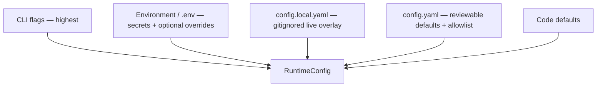

# Config surface (LOCKED v1)

**Status:** Locked. Human override 2026-09-11: default **Ollama**, and **`config set: YES`**.

---

## Layers (precedence high → low)



`config show` prints **effective value + winning layer** for every key (`cli` | `env` | `local` | `file` | `default`).  
List fields: **replace from highest layer**, never silent concat.

Copy `config.local.example.yaml` → `config.local.yaml` for live ATS hosts / `session.storageStatePath`. Never commit the local file.

CLI: `--storage-state <path>` sets `session.storageStatePath` (repo-relative).

---

## What lives where

| Concern | `.env` | `config.yaml` | CLI | `config set` |
|---|---|---|---|---|
| API keys (cloud) | ✅ only | ❌ | ❌ | ❌ refuse |
| provider / model | optional | ✅ default | `--provider` / `--model` | ✅ non-secret |
| Ollama base URL | optional | ✅ | `--ollama-url` | ✅ |
| target base URL | ❌ | ✅ | `--base-url` | ✅ |
| allowlist hosts/actions | ❌ | ✅ | ❌ | ✅ (writes yaml) |
| max steps / timeouts | optional | ✅ | flags | ✅ |
| headed | ❌ | ✅ | `--headed` | ✅ |

---

## Draft `config.yaml`

```yaml
schemaVersion: 1

llm:
  provider: ollama                 # ollama | anthropic | openai
  model: qwen3.5:9b
  ollamaBaseUrl: http://127.0.0.1:11434

target:
  name: mock-core
  baseUrl: http://127.0.0.1:4173
  entryPath: /member-lookup

policy:
  allowedHosts:
    - 127.0.0.1
    - localhost
  allowedActions:
    - navigate
    - click
    - fill
    - extract
    - wait
    - branch
  riskyActions:
    - submit_irreversible
    - transfer_funds

limits:
  maxSteps: 40
  stepTimeoutMs: 15000
  runTimeoutMs: 300000

session:
  headedOnEscalate: true
  pauseScreenshot: true

evidence:
  dir: evidence
  redactSensitiveOutputs: true
```

---

## `.env.example`

```bash
LLM_PROVIDER=ollama
LLM_MODEL=qwen3.5:9b
OLLAMA_BASE_URL=http://127.0.0.1:11434

# Optional cloud later:
# LLM_PROVIDER=anthropic
# ANTHROPIC_API_KEY=
# LLM_PROVIDER=openai
# OPENAI_API_KEY=
```

---

## Operator commands (v1)

- `config show` — merged config + source layer per key  
- `config validate` — fail closed on unknown keys / bad allowlist; require cloud key only when provider is anthropic/openai; for ollama check reachable base URL when discovering  
- `config set <dotted.key> <value>` — writes **non-secret** keys into `config.yaml` only; **refuses** `*API_KEY*` / secret paths; then suggest `config show` to confirm winning layer (env/CLI may still override)

Examples:
```bash
config set llm.provider openai
config set llm.model gpt-4.1
config set llm.provider ollama
config set llm.model qwen3.5:9b
```
