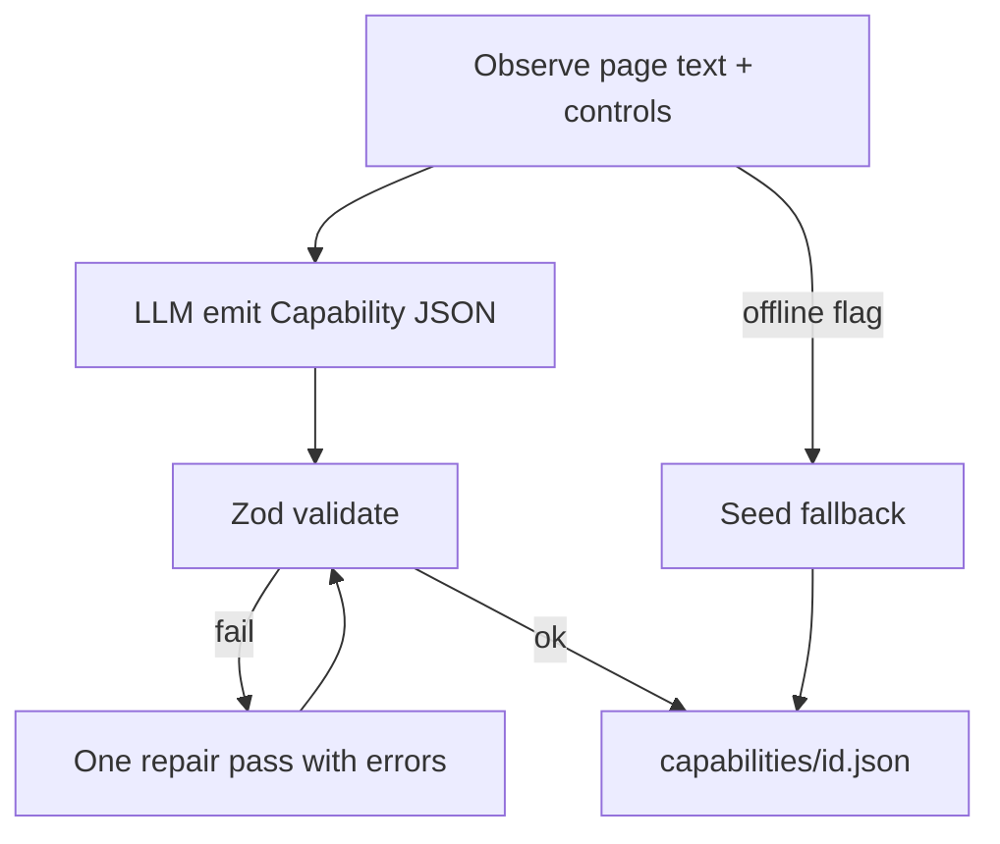

# Discovery → Capability emission (LOCKED v1 + emit upgrade)

**Status:** Locked algorithm remains. **Implementation note:** v1 first shipped as seed+LLM-confirm; upgraded so the LLM **emits** Capability JSON from observation (seed only with `--allow-offline-seed`).

## What the LLM receives (and does not)

| Give | Do not give |
|---|---|
| NL goal | Hand-authored `capabilities/*.json` seed file |
| Compact page observation (text + controls) | Permission to invent steps / full Capability shape |
| **Strict locator-only JSON contract** (+ Ollama JSON Schema `format`) | Secrets / cookies / screenshots in the prompt |

**Code owns** the Capability skeleton (steps, IO, checkpoints). The model **only** emits `targets.*.candidates`. Zod (`EmitLocatorsSchema`) fail-closed; one repair; observation grounding if still invalid.

## Algorithm

1. Navigate to `config.target` entry; screenshot for evidence.
2. Build observation (visible text + interactive control inventory).
3. Ask Ollama to return **only** a Capability JSON object matching the contract.
4. `CapabilitySchema` fail-closed; one repair retry with Zod issues.
5. Replay never sees the LLM transcript.

Offline: `--allow-offline-seed` copies the seed file (demo without Ollama).

## compile rules

| Keep | Drop |
|---|---|
| Goal-advancing successful acts | Failed probes, exploratory clicks, HITL keystrokes |
| Collapsed consecutive fills on same target | Spinner spam (prefer one `wait` or rely on locator timeout) |
| `branch` if not-found path was observed (or merge from a second discovery with `M-99999`) | Free-form “think” steps |

**Locators:** for each hit target, emit ranked candidates: role(+name) → label → placeholder/text → testId → css (`rank` 99). `strict: true`. Drop candidates that match >1 node.

**Bindings:** if typed value equals declared param → `valueFrom: "inputs.<name>"`. Entry URL → `urlFrom: "config.target.entryPath"`. Never store discovery literals for inputs.

**`bindings: {}`:** always emit empty; never populate in v1 (tenant overlays later at replay).

## Never in the artifact

Secrets, raw PII, passwords, cookies, screenshots, LLM prompts/tool dumps, full a11y trees, undeclared outcome codes, CSS-only checkpoints, HITL recovery paths.
