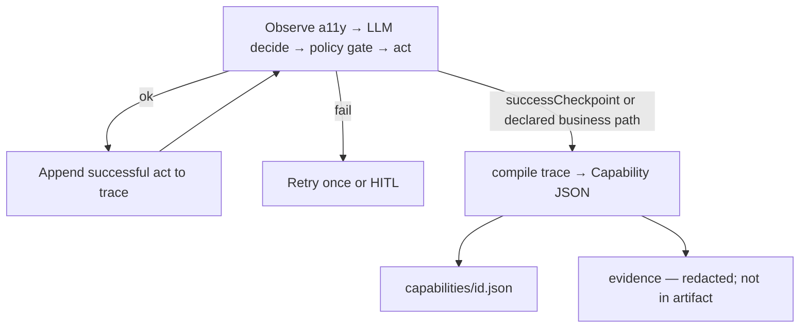

# Discovery → Capability emission (LOCKED v1)

**Status:** Locked via [Lock discovery → artifact emission rules](../.scratch/computer-use-automation/issues/04-lock-discovery-emission-rules.md) after council.

## Algorithm

1. During discovery, **log only successful** allowlisted acts (`navigate|fill|click|extract|wait|branch`).
2. On terminal success (or after a run that also observed the not-found path), **compile once**.
3. Replay never sees the LLM transcript.

## compile rules

| Keep | Drop |
|---|---|
| Goal-advancing successful acts | Failed probes, exploratory clicks, HITL keystrokes |
| Collapsed consecutive fills on same target | Spinner spam (prefer one `wait` or rely on locator timeout) |
| `branch` if not-found path was observed (or merge from a second discovery with `M-99999`) | Free-form “think” steps |

**Locators:** for each hit target, emit ranked candidates: role(+name) → label → placeholder/text → testId → css (`rank` 99). `strict: true`. Drop candidates that match >1 node.

**Bindings:** if typed value equals declared param → `valueFrom: "inputs.<name>"`. Entry URL → `urlFrom: "config.target.entryPath"`. Never store discovery literals for inputs.

**`bindings: {}`:** always emit empty; never populate in v1 (tenant overlays later at replay).

## Never in the artifact

Secrets, raw PII, passwords, cookies, screenshots, LLM prompts/tool dumps, full a11y trees, undeclared outcome codes, CSS-only checkpoints, HITL recovery paths.
