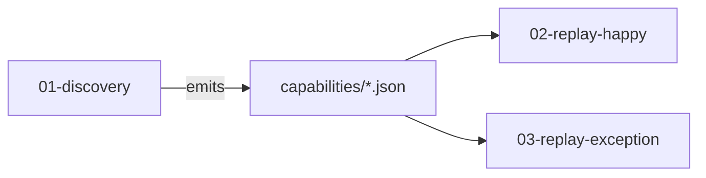

# Evidence layout (LOCKED v1)

**Status:** Locked for core demo chapters + private apply runs.

## Demo evidence bag (committed)

Chapter names so a 60-second open of `/evidence/` tells the story:

```
evidence/
  01-discovery/
    manifest.json      # goal, provider, model, artifactPath, artifactSha256, llmCalls >= 1
    run.json           # redacted step ledger
    result.json
    screenshots/
  02-replay-happy/
    manifest.json      # artifactSha256, params redacted, llmCalls: 0
    run.json
    result.json        # SUCCESS + outputs
    screenshots/
  03-replay-exception/
    manifest.json      # llmCalls: 0
    run.json
    result.json        # BUSINESS_OUTCOME member.NOT_FOUND
    screenshots/
      terminal.png     # required richer signal
  README.md            # one-paragraph map of the bag
  private/             # gitignored — live apply / HAR (never commit)
```

Capability canonical file lives in `capabilities/`; each manifest stores **path + sha256** (and `01-discovery` may also keep a copy `capability.snapshot.json` for a self-contained bag).



## Live runs (local, not necessarily committed)

```
evidence/runs/<runId>/
  meta.json
  events.jsonl
  hitl/   # intervention.json, resume.json when used
  screenshots/

evidence/private/<runId>/   # cua apply default; gitignored
  result.json
  worker.json
  network.har               # only if --record-har and path under private/
```

## HAR / trace

- Default: no HAR. Opt-in `--record-har` / `--har-on-failure` / `--trace-on-failure`.
- **P6:** HAR files outside `evidence/private/` are deleted after the run unless `CUA_ALLOW_PUBLIC_HAR=1`.
- Prefer `--har-on-failure` so happy paths never keep network dumps.

## Redaction

- No raw API keys, passwords, or `sensitive: true` values on disk  
- Redacted placeholders in logs; `redaction.json` lists scrubbed field names  
- Replay manifests must show `llmCalls: 0` for core happy/exception chapters (opt-in `--hitl-locator-patch` / `--auto-retrain` may raise the count on experimental runs)

## Cuts

No required screen recording. No DOM dump in the core bag. HITL proof can live under live `runs/` plus REPORT; optional `hitl/` folder inside a chapter if a demo run used escalation.
