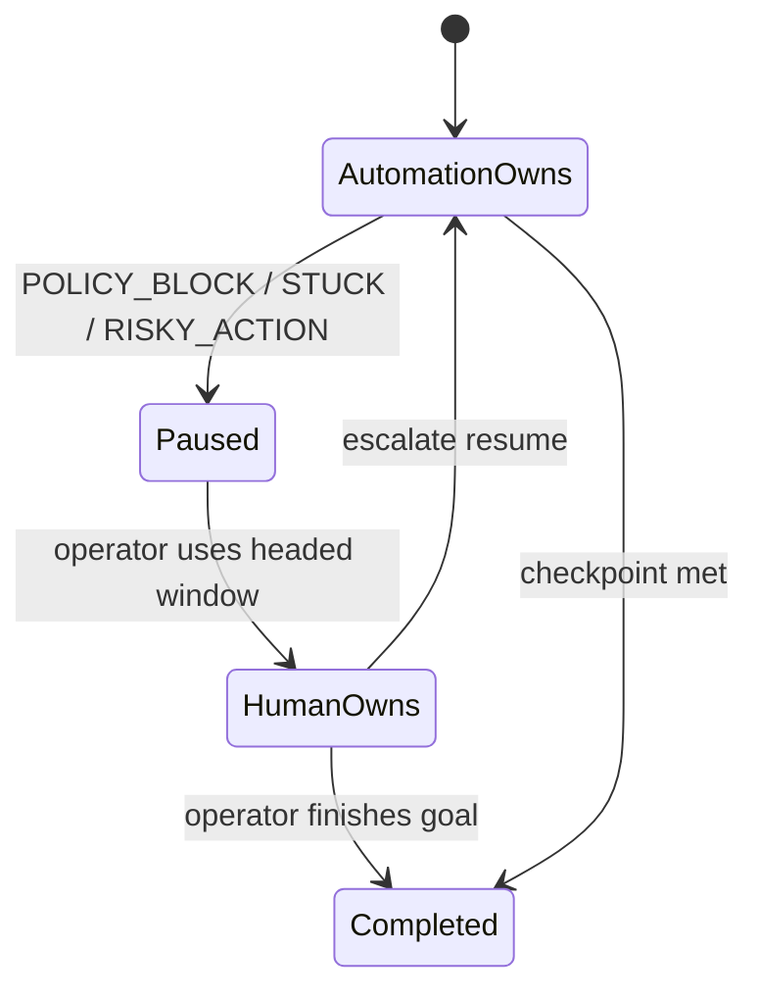

# HITL handoff contract (LOCKED v1)

**Status:** Locked via [Lock HITL intervention payload and resume contract](../.scratch/computer-use-automation/issues/06-lock-hitl-handoff-contract.md) after council.

## Non-negotiables

1. Same Playwright `BrowserContext` / pages / cookies — never a second browser for handoff.  
2. Exclusive ownership: while paused/human, automation issues **zero** actions.  
3. Operator UI may be minimal: headed window + CLI.  
4. Human clicks are **opaque** — record resume metadata + note, not a fake click transcript.



## Pause reason codes

| Code | When |
|---|---|
| `POLICY_BLOCK` | Host/action outside allowlist |
| `RISKY_ACTION` | Action listed in `riskyActions` |
| `STUCK` | Locator uniqueness/visibility exhausted or max-steps without progress |

## Intervention file

`evidence/<runId>/hitl/intervention.json`:

```json
{
  "schemaVersion": 1,
  "runId": "run_01",
  "mode": "replay",
  "reasonCode": "STUCK",
  "reasonDetail": "No unique locator for searchButton",
  "capabilityId": "lookup-member-savings-balance",
  "stepId": "s3",
  "goalSnapshot": "Look up member M-10042...",
  "pageUrl": "http://127.0.0.1:4173/member-lookup",
  "screenshotPath": "evidence/run_01/hitl/pause.png",
  "owner": "paused",
  "pausedAt": "2026-09-11T15:00:00Z"
}
```

## Resume

```bash
escalate resume --run <runId> [--note "..."]
```

Writes `evidence/<runId>/hitl/resume.json` with `resumedAt`, `note`, `humanActionsRecorded: false`.  
Then `owner=automation`; next step **re-observes** live DOM (does not assume pre-pause locators still hold).

## Grader UX

Terminal prints pause reason + run id + screenshot path → use open headed browser → resume command → automation continues.
