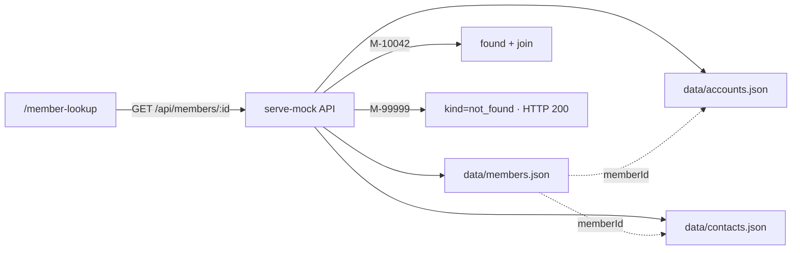

# Mock-core screens (LOCKED v1 + store upgrade)

**Status:** Locked demo IDs remain. Store upgraded to connected JSON tables + thin API (still no Postgres).

## Decision

Static UI under `apps/mock-core/` + **thin Node API** that joins JSON “tables” (`scripts/serve-mock.mjs`). No real RDBMS.

## Screens

1. **Member Lookup** (`/member-lookup/`)
   - Demo strip: `M-10042` found · `M-99999` not found (+ extra sample IDs)
   - Field labeled **Member ID** (`name="member_id"`)
   - Button accessible name **Search**
   - Hostility: nested layout `<table>`, duplicate inert “Search”, **no `data-testid`**, weak landmarks

2. **Result (same page)**
   - Happy: member master + contact + linked accounts; **Savings balance** → `$12,480.55`, name `Alex Rivera`
   - Not found: `[role=alert]` text **Member not found**
   - Status while loading: `[role=status]` querying / joining

## Seed IDs

| ID | Result |
|---|---|
| `M-10042` | Happy — Alex Rivera, savings `$12,480.55` (+ checking) |
| `M-99999` | `member.NOT_FOUND` (HTTP **200**, business outcome) |
| `M-10007`, `M-10015`, `M-20418`, `M-33102`, `M-44001`, `M-55018`, `M-66044` | Extra found members for realism |

## Data model (JSON tables)

| File | Key | Links |
|---|---|---|
| `data/members.json` | `memberId`, `cif` | — |
| `data/accounts.json` | `accountId` | `memberId` → members |
| `data/contacts.json` | `contactId` | `memberId` → members |

Join in `apps/mock-core/lib/db.js` (`lookupMember`).

## API

- `GET /api/health`
- `GET /api/members` → id list
- `GET /api/members/:id` → found join **or** `{ kind:'not_found', code:'member.NOT_FOUND' }` with **HTTP 200**

## Explicitly out

- Login wall  
- Postgres / SQLite / ORM  
- Second tenant UI  
- iframes/framesets in v1  
- `data-testid`  
- Treating not-found as HTTP 404 / crash  

## REPORT hook

Treat this mock as “Tenant Alpha” surface; multi-tenant = capability + locator override packs (design-only).
