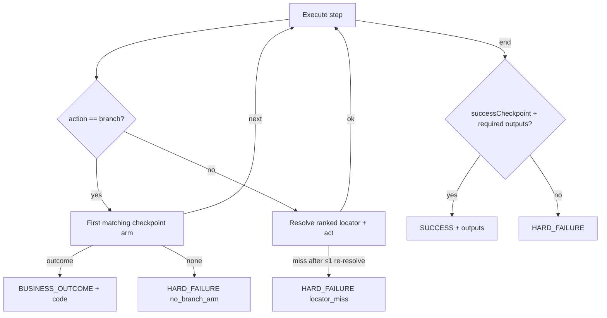

# Replay outcome rules (LOCKED v1)

**Status:** Locked via [Lock replay outcome detection rules](../.scratch/computer-use-automation/issues/05-lock-replay-outcome-rules.md) after council.

## Classification (zero LLM)



| Status | When (v1) |
|---|---|
| `SUCCESS` | Reach `successCheckpoint`; all required outputs filled |
| `BUSINESS_OUTCOME` | `branch` arm with `outcome` (e.g. `member.NOT_FOUND`) |
| `RECOVERABLE` | **Reserved** — enum kept; **no emitters in mock v1** |
| `HARD_FAILURE` | Locator miss, no branch arm, policy block, missing outputs |

Business detection = **branch only**. Ranked candidate walk inside `timeoutMs` is normal resolution, not `RECOVERABLE`.

## Result JSON (CLI / calling agent)

```json
{
  "ok": true,
  "status": "SUCCESS",
  "code": null,
  "message": "Member savings balance extracted",
  "capabilityId": "lookup-member-savings-balance",
  "capabilityVersion": "1.0.0",
  "params": { "memberId": "M-10042" },
  "outputs": { "savingsBalance": "$12,480.55" },
  "error": null,
  "runId": "…",
  "evidenceDir": "evidence/02-replay-happy",
  "durationMs": 1200,
  "llmCalls": 0
}
```

Not-found example: `ok: true`, `status: "BUSINESS_OUTCOME"`, `code: "member.NOT_FOUND"`, empty `outputs`, exit code **0**.  
Hard failure: `ok: false`, `status: "HARD_FAILURE"`, `error: { reason, stepId }`, exit **≠ 0**.
